# Autonomous Marketing Agent — Architecture v0.3 (PoC)

First-draft architecture for a hackathon-scoped autonomous marketing agent. The system spawns a recursive tree of agents that ideate t-shirt designs, generate images, launch Facebook ads, poll performance, and iterate — all without human-in-the-loop after the seed.

**Status:** Draft 3. Many decisions are placeholders flagged as `> **TBD:** ...`. The goal is to make the structural shape concrete enough to argue about, not to specify implementation.

**Modeled on:** [Agentic Fractals v1 architecture](https://github.com/breedoon/agentic-fractals) — same subgraph-per-procedure layout, fork-spawn arrows, return arrows, artifact persistence. Adapted from one-shot task execution to a long-running scheduled loop, with three deliberate structural deviations:

1. **Branch Routers always take over** (spawn 1–3 sub-routers per wake) instead of deciding their own fate.
2. **Selection** (pruning underperformers, scaling winners) is performed by a separate scheduled **Strategy Agent**, not by the branches and not by Root.
3. **Operations** is its own scheduled agent that watches system health (APIs, budget, stuck branches, broken scripts) and self-heals via fix-it forks. Root spawns it once at startup and exits.

The system has two scheduled tiers above the leaf executors. Their cadence determines a structural choice (same-agent vs fresh-wake) explained in [Tier Conventions](#tier-conventions).

---

## Scope

**Bounded:** Proof-of-concept meant to run end-to-end within a single day (~12–24 hours). No multi-day state, no production hardening, no human approval gates after launch.

**Goal:** Demonstrate that a recursive tree of scheduled agents can autonomously (a) generate t-shirt design ideas, (b) launch Facebook ads with AI-generated images, (c) measure ad performance, (d) iterate on what's working, and (e) produce a final report with learnings.

**Success criteria for the PoC** (not for the marketing campaign):
- The system runs unattended for the PoC duration without a human unblocking it.
- At least one ad gets clicks attributable to an autonomously generated design.
- Strategy Agent produces learnings that reflect actual performance patterns (not generic LLM rumination).
- The system kills bad branches and scales good ones (visible in the artifact tree and Strategy's reports).

---

## Design Principles

Inherited from Agentic Fractals v1, with adaptations:

1. **Everyone is a fork by default.** Same as v1.
2. **One agent per task.** Routers route, leaves execute, scheduled agents do scheduled work.
3. **Fork prompts are one sentence.** Same as v1.
4. **Forks are basically free.** Same as v1.
5. **Every agent writes an artifact.** Same as v1.
6. **Resume, don't replace.** Especially important here — scheduled agents wake frequently and must be resumable.
7. **Tier-bounded recursion, not complexity-bounded.** No Scoping procedure assessing complexity. Recursion is bounded by tier schedule, active-branch cap, and the PoC deadline.
8. **Branches always branch forward; selection is external.** Branch Routers spawn 1–3 sub-routers per wake. They never self-kill, self-scale, or hold. Strategy (not branches, not Root) decides which branches die.
9. **Adversarial divergence, not adversarial verification.** v1's Verifier/Auditor are replaced by Brainstorming with an embedded debate phase. Goal is exploration of design space, not pass/fail.
10. **Learnings are durable, agents are ephemeral.** Shared `state/learnings/*.md` files are long-term memory. Any agent's context is disposable.
11. **Two-tier scheduled agents: short-cycle same-agent vs long-cycle fresh-wake.** Wake cadence determines structure — see [Tier Conventions](#tier-conventions).
12. **Self-healing through fix-it forks, not procedure branches.** Operations doesn't enumerate every possible problem in a procedure. It dispatches investigation forks each wake, and dispatches additional fix-it forks until issues clear.
13. **Original recursive router pattern is preserved for ad-hoc feature/fix work.** When something breaks (image-gen API change, new FB API quirk, a missing helper script), invoke the [Implementation Router](#procedure-8-implementation-router-fix-it--feature-work) on `state/work/current.md` to scope and execute the fix.

---

## Tier System

Four scheduled tiers govern wake cadence. Each tier has a different scope of decision and a different structural pattern (same-agent vs fresh-wake — see [Tier Conventions](#tier-conventions)).

| Tier | Cadence | Procedure | Decision scope | Tier structure |
|---|---|---|---|---|
| **Tactical** | ~15–30 min | Performance Poller | Just fetch metrics. No decisions. | Short-cycle, same-agent |
| **Iteration** | ~30 min | Branch Router takeover | Per branch: read metrics, spawn 1–3 sub-routers with next variants. | Short-cycle, same-agent |
| **Operations** | 55 min | Operations Agent | System health: budget, agent state, API status, broken scripts, paused campaigns. Self-heals via fix-it forks. | Short-cycle, same-agent |
| **Strategy** | 2 hours | Strategy Agent | Cross-tree: prune underperformers (sends "stop" messages externally), scale winners, seed new themes. Owns the final report at deadline. | Long-cycle, fresh-wake |

> **TBD:** Exact intervals. Tactical may need to be longer if FB Ads API metrics are slow (15–60 min delay). Iteration at 30 min is tentative — too fast and the tree explodes faster than Strategy can prune; too slow and the PoC under-iterates. Operations at 55 min is offset from hourly to avoid colliding with cron-aligned external traffic. Strategy at 2h gives ~6 sweeps over a 12h run.

> **TBD:** Schedule mechanism. Default proposal: OBS `CronCreate` with `schedule_mode: "interval"` per scheduled agent — keeps the scheduling inside the OBS lineage tree.

> **TBD:** Tree growth vs. Strategy cadence. With 30-min iteration and 1–3 spawns per wake, a single branch can produce 3^N descendants over N wakes. Strategy at 2h means ~4 iteration cycles between prunes. Aggressiveness of pruning (what fraction gets killed per sweep) is the dominant control on cost. Operations enforces a hard active-branch ceiling between Strategy sweeps.

---

## Tier Conventions

Wake cadence determines whether a scheduled agent persists across wakes or wakes up fresh each time. This is a structural property of the tier, not a per-agent decision.

### Short-cycle (<1h): Same-agent continuation

Agents whose wake interval is under an hour (Tactical, Iteration, Operations) persist across wakes. Same OBS session, same conversation, same context. The Anthropic prompt cache TTL (~5 min) is broken on each wake, but the in-context memory survives — so the agent can remember what it observed last time without round-tripping through an artifact.

**Pattern:**
1. Wake up.
2. Do the work (read relevant artifacts, dispatch sub-forks, take actions).
3. Update small artifacts inline.
4. Reschedule (or rely on the existing interval schedule).

**Why:** For frequent wakes, the cost of re-reading a verbose artifact every wake exceeds the value of fresh context. Short-cycle agents have small, well-bounded jobs — health checks, polling, single-step takeovers — and a few hundred tokens of accumulated context across wakes is fine.

### Long-cycle (≥2h): Fresh-wake with living artifact

Agents whose wake interval is two hours or more (Strategy) reset between wakes. New OBS session, no inherited context. They serialize themselves to a verbose **living artifact** before sleeping and rehydrate from it on wake.

**Pattern:**
1. Wake up fresh (no inherited context).
2. **Read the living artifact** — the previous wake's report. This contains the full operating state needed to resume.
3. Do the work (dispatch investigation sub-forks, decide, act on the tree).
4. **Write the new living artifact** — verbose (1000+ lines): current strategy, progress since last wake, direction for next interval, active branches and their status, pruned branches and rationale, pattern observations, budget/timeline status, open uncertainties, anything else needed to resume cleanly without context.
5. Reset/sleep until next wake.

**Why:**
- **Context degradation.** Long-running agents accumulate stale context, drift in their summaries, and lose uncertainty markers when compacted. Fresh wakes guarantee a clean view.
- **Cache miss is amortized anyway.** A 2h+ gap exceeds the prompt cache TTL — there's no cache to preserve, so the cost of re-reading a verbose artifact is the same whether you continue the session or start fresh.
- **Fresh perspective.** Strategy decisions benefit from a fresh look at the data without prior bias. The artifact captures facts; the agent re-derives judgments.
- **Crash recovery.** If a wake crashes, the next wake reads the prior artifact and resumes. No special recovery code needed.

**Verbosity is the point.** The living artifact is intentionally over-written — repeat the strategy, repeat the rationale, repeat the open questions. The next wake is a stateless reader; assume nothing carries over.

> **TBD:** Storage path for living artifacts. Proposal: `state/strategy/current.md` (live), `state/strategy/history/{timestamp}.md` (rotation). Operations also has one at `state/operations/current.md` but short-cycle ones are smaller and may not need rotation.

---

## Procedure Inventory — Centerpiece Diagram

Eight procedures, each as a subgraph. Fork spawns = arrows into the first step of a target procedure. Returns = arrows back to a decision/next step in the caller. Dotted arrows = scheduled wake-ups or asynchronous reads. External-action arrows (kill messages, budget changes) are shown distinctly.

```mermaid
flowchart TD
    %% ============================================
    %% ROOT ROUTER (one-shot startup, then exits)
    %% ============================================
    subgraph RR ["🌳 Root Router (one-shot startup)"]
        RR_SEED["<b>Receive seed</b><br/>theme, audience,<br/>total budget cap,<br/>PoC deadline"]
        RR_INIT["<b>Spawn N Brainstorming forks</b><br/>(Wave 0 — initial diversity)"]
        RR_DISPATCH["<b>For each top-ranked design:</b><br/>spawn Branch Router fork<br/>(scheduled, Iteration tier)"]
        RR_OPS["<b>Spawn Operations Agent</b><br/>(scheduled, every 55 min,<br/>short-cycle, same-agent)"]
        RR_STR["<b>Spawn Strategy Agent</b><br/>(scheduled, every 2 hours,<br/>long-cycle, fresh-wake)"]
        RR_EXIT["<b>Write seed artifact</b><br/>(seed values, dispatched branches,<br/>scheduled agent IDs)<br/>→ exit"]

        RR_SEED --> RR_INIT
        RR_INIT --> RR_DISPATCH
        RR_DISPATCH --> RR_OPS
        RR_OPS --> RR_STR
        RR_STR --> RR_EXIT
    end

    %% ============================================
    %% BRANCH ROUTER (takeover pattern — always branches forward)
    %% ============================================
    subgraph BR ["🌿 Branch Router (per-design — takeover pattern)"]
        BR_RECV["<b>Receive design brief</b><br/>text description,<br/>budget allocation,<br/>parent branch (if any)"]
        BR_PUB["<b>Spawn Designer/Publisher</b><br/>fork: generate image,<br/>launch FB ad"]
        BR_POLL["Spawn Performance Poller<br/>fork (scheduled, Tactical)"]
        BR_SCHED["Schedule self wake-up<br/>(Iteration tier, ~30 min)"]
        BR_WAKE{"On wake:<br/>read latest<br/>poller artifact"}
        BR_BRAIN["<b>Spawn Brainstorming fork</b><br/>seeded with branch metrics<br/>+ shared learnings<br/>→ ranked variant briefs"]
        BR_TAKEOVER["<b>Takeover:</b><br/>spawn 1–3 sub-Branch-Routers,<br/>one variant each (recursive)"]

        BR_RECV --> BR_PUB
        BR_PUB --> BR_POLL
        BR_POLL --> BR_SCHED
        BR_SCHED -.->|"on wake"| BR_WAKE
        BR_WAKE --> BR_BRAIN
        BR_BRAIN --> BR_TAKEOVER
        BR_TAKEOVER --> BR_SCHED
    end

    %% ============================================
    %% BRAINSTORMING (divergent + debate + synth)
    %% ============================================
    subgraph BS ["💡 Brainstorming (divergent + debate + synth)"]
        BS_READ["<b>Read context</b><br/>shared learnings,<br/>sibling artifacts,<br/>parent brief + metrics"]
        BS_DIV["<b>Wave 1: Divergent</b><br/>spawn N parallel<br/>Brainstormer forks<br/>(each pitches one design)"]
        BS_DEBATE["<b>Wave 2: Debate</b><br/>debater forks<br/>+ mandatory contrarian"]
        BS_SYNTH["<b>Wave 3: Synthesis</b><br/>rank designs,<br/>preserve dissent,<br/>recommend top K"]
        BS_ART["<b>Write artifact</b><br/>ranked briefs +<br/>debate summary"]
        BS_RET["Return top K briefs"]

        BS_READ --> BS_DIV
        BS_DIV --> BS_DEBATE
        BS_DEBATE --> BS_SYNTH
        BS_SYNTH --> BS_ART
        BS_ART --> BS_RET
    end

    %% ============================================
    %% DESIGNER / PUBLISHER (leaf executor)
    %% ============================================
    subgraph DP ["🎨 Designer / Publisher (leaf)"]
        DP_RECV["<b>Receive design brief</b>"]
        DP_IMG["Image-gen API call<br/>→ save image"]
        DP_QC{"Image passable?"}
        DP_RETRY["Retry refined prompt<br/>(max 2x)"]
        DP_COPY["LLM-generate ad copy<br/>(headline, body, CTA)"]
        DP_CAMP["FB Ads API:<br/>create campaign,<br/>ad set, ad,<br/>set daily budget, launch"]
        DP_ART["<b>Write artifact</b><br/>ad_id, campaign_id,<br/>image, copy, timestamp"]
        DP_RET["Return ad metadata"]

        DP_RECV --> DP_IMG
        DP_IMG --> DP_QC
        DP_QC -->|"No"| DP_RETRY
        DP_RETRY --> DP_IMG
        DP_QC -->|"Yes"| DP_COPY
        DP_COPY --> DP_CAMP
        DP_CAMP --> DP_ART
        DP_ART --> DP_RET
    end

    %% ============================================
    %% PERFORMANCE POLLER (scheduled, tactical, short-cycle)
    %% ============================================
    subgraph PP ["📊 Performance Poller (scheduled, Tactical, short-cycle)"]
        PP_LIST["Read active ad IDs<br/>for assigned branch"]
        PP_FETCH["FB Ads API:<br/>impressions, clicks,<br/>CTR, spend, CPC"]
        PP_LOG["Append snapshot to<br/>state/performance/{branch}.md"]
        PP_ART["<b>Write artifact</b><br/>latest metrics snapshot"]
        PP_SCHED["Reschedule self<br/>(Tactical tier)"]

        PP_LIST --> PP_FETCH
        PP_FETCH --> PP_LOG
        PP_LOG --> PP_ART
        PP_ART --> PP_SCHED
        PP_SCHED -.->|"on wake"| PP_LIST
    end

    %% ============================================
    %% OPERATIONS AGENT (scheduled, every 55 min, short-cycle, self-healing)
    %% ============================================
    subgraph OP ["🔧 Operations Agent (every 55 min, short-cycle, same-agent)"]
        OP_WAKE["<b>Wake-up</b><br/>(same agent, persistent context)"]
        OP_DISPATCH["<b>Dispatch parallel health-check forks:</b><br/>• agent health (zombies, hangs)<br/>• budget consumption<br/>• long-running branches<br/>• FB Ads API status<br/>• image-gen API status<br/>• campaigns running (any unexpectedly paused?)<br/>• poller freshness<br/>• disk / state integrity"]
        OP_GATHER["Gather check results"]
        OP_ANY{"Any issues<br/>found?"}
        OP_FIX["<b>Dispatch fix-it forks</b><br/>(one per issue, parallel where independent)<br/>each: investigate → attempt fix → report"]
        OP_RECHECK{"All issues<br/>resolved?"}
        OP_ESCALATE["Append to state/work/current.md<br/>(unresolved issues for next Strategy / Implementation Router)"]
        OP_LOG["<b>Update state/operations/current.md</b><br/>(health snapshot, issues found, fixes applied)"]
        OP_SCHED["Schedule next wake<br/>(Operations tier, 55 min)"]

        OP_WAKE --> OP_DISPATCH
        OP_DISPATCH --> OP_GATHER
        OP_GATHER --> OP_ANY
        OP_ANY -->|"Yes"| OP_FIX
        OP_FIX --> OP_RECHECK
        OP_RECHECK -->|"No — keep trying"| OP_FIX
        OP_RECHECK -->|"Yes"| OP_LOG
        OP_RECHECK -->|"Some unresolved"| OP_ESCALATE
        OP_ESCALATE --> OP_LOG
        OP_ANY -->|"No"| OP_LOG
        OP_LOG --> OP_SCHED
        OP_SCHED -.->|"on wake"| OP_WAKE
    end

    %% ============================================
    %% STRATEGY AGENT (scheduled, every 2h, long-cycle, fresh-wake)
    %% ============================================
    subgraph STR ["🧠 Strategy Agent (every 2 hours, long-cycle, fresh-wake)"]
        STR_WAKE["<b>Fresh wake</b><br/>(new session, no context)"]
        STR_READ["<b>Read living artifact</b><br/>state/strategy/current.md<br/>(prior strategy, prior decisions,<br/>active branches, learnings index)"]
        STR_INVESTIGATE["<b>Dispatch investigation forks (parallel):</b><br/>• per-branch performance analysis<br/>• cross-branch pattern detection<br/>• comparison vs prior wake's predictions<br/>• budget burn-rate projection<br/>• deadline check"]
        STR_DECIDE["<b>Decide:</b><br/>which branches to prune,<br/>which to scale,<br/>which new themes to seed,<br/>any updates to learnings"]
        STR_DEADLINE{"Deadline<br/>reached?"}
        STR_PRUNE["<b>External pruning (act on tree):</b><br/>for each pruned branch:<br/>• SendInboxMessage 'stop, remove schedule'<br/>• pause FB ad via API<br/>• TaskStop if unresponsive<br/>• write pruned artifact"]
        STR_SCALE["<b>External scaling:</b><br/>raise FB ad daily budget for winners<br/>via API (no message to branch)"]
        STR_SEED["<b>Seed new themes</b><br/>(if recommended):<br/>spawn fresh Branch Routers"]
        STR_LEARN["<b>Update shared learnings</b><br/>state/learnings/*.md<br/>(overwrite, keep concise)"]
        STR_REPORT["<b>Write new living artifact</b><br/>state/strategy/current.md<br/>(VERBOSE — 1000+ lines)<br/>current strategy, progress, direction,<br/>active branches, pruned + rationale,<br/>patterns, budget/timeline, open questions"]
        STR_ROTATE["Archive prior artifact<br/>state/strategy/history/{ts}.md"]
        STR_SCHED["Schedule next fresh wake<br/>(Strategy tier, 2 hours)"]
        STR_FINAL["<b>Write final report</b><br/>top performers, learnings,<br/>total spend, total clicks<br/>→ terminate all live branches,<br/>terminate Operations,<br/>exit (no reschedule)"]

        STR_WAKE --> STR_READ
        STR_READ --> STR_INVESTIGATE
        STR_INVESTIGATE --> STR_DECIDE
        STR_DECIDE --> STR_DEADLINE
        STR_DEADLINE -->|"No"| STR_PRUNE
        STR_PRUNE --> STR_SCALE
        STR_SCALE --> STR_SEED
        STR_SEED --> STR_LEARN
        STR_LEARN --> STR_REPORT
        STR_REPORT --> STR_ROTATE
        STR_ROTATE --> STR_SCHED
        STR_SCHED -.->|"on next fresh wake"| STR_WAKE
        STR_DEADLINE -->|"Yes"| STR_FINAL
    end

    %% ============================================
    %% IMPLEMENTATION ROUTER (ad-hoc fix-it / feature work)
    %% ============================================
    subgraph IR ["🛠️ Implementation Router (ad-hoc fix-it, on-demand)"]
        IR_TRIGGER["<b>Triggered by:</b><br/>• Operations escalation<br/>• Strategy decision<br/>• human invocation<br/>(read state/work/current.md)"]
        IR_SCOPE["<b>Scope</b><br/>(per procedures/scope.md)<br/>assess complexity, decompose"]
        IR_LOOP["<b>Loop / Executor / Verifier</b><br/>(per procedures/*.md —<br/>v1 OBS recursive pattern)"]
        IR_AUDIT["<b>Auditor / Unblock</b><br/>(as needed)"]
        IR_ARTIFACT["<b>Write fix artifact</b><br/>state/work/done/{task-id}.md<br/>+ update state/work/current.md"]

        IR_TRIGGER --> IR_SCOPE
        IR_SCOPE --> IR_LOOP
        IR_LOOP --> IR_AUDIT
        IR_AUDIT --> IR_ARTIFACT
    end

    %% ============================================
    %% CROSS-PROCEDURE CONNECTIONS
    %% ============================================

    %% Root → Brainstorming (initial wave)
    RR_INIT -->|"fork (×N)"| BS_READ
    BS_RET -.->|"return"| RR_DISPATCH

    %% Root → Branch Routers (initial dispatch)
    RR_DISPATCH -->|"fork per design"| BR_RECV

    %% Root → Operations + Strategy (spawn-and-exit)
    RR_OPS -->|"fork (scheduled)"| OP_WAKE
    RR_STR -->|"fork (scheduled)"| STR_WAKE

    %% Branch Router → Designer/Publisher
    BR_PUB -->|"fork"| DP_RECV
    DP_RET -.->|"return"| BR_POLL

    %% Branch Router → Performance Poller
    BR_POLL -->|"fork (scheduled)"| PP_LIST

    %% Branch Router → Brainstorming (variant exploration each wake)
    BR_BRAIN -->|"fork"| BS_READ
    BS_RET -.->|"return"| BR_TAKEOVER

    %% Branch Router → sub Branch Routers (takeover, recursive)
    BR_TAKEOVER -->|"fork (×1–3)"| BR_RECV

    %% Performance Poller artifacts read async by Branch Router on wake
    PP_ART -.->|"read on next wake"| BR_WAKE

    %% Strategy → Branches (external prune + scale)
    STR_PRUNE ==>|"SendInboxMessage 'stop'<br/>+ pause FB ad<br/>+ TaskStop"| BR_SCHED
    STR_SCALE ==>|"raise FB ad budget via API<br/>(external; no branch msg)"| BR_SCHED

    %% Strategy → fresh Branch Routers (new themes)
    STR_SEED -->|"fork"| BR_RECV

    %% Operations → Implementation Router (escalation path)
    OP_ESCALATE -.->|"appends to state/work/current.md<br/>(picked up on demand)"| IR_TRIGGER

    %% Strategy → Implementation Router (escalation path)
    STR_DECIDE -.->|"can escalate fix-it tasks<br/>via state/work/current.md"| IR_TRIGGER

    %% Implementation Router → Operations (post-fix verification)
    IR_ARTIFACT -.->|"next Ops wake re-checks"| OP_WAKE

    %% ============================================
    %% STYLING
    %% ============================================
    style RR fill:#1a1a2e,color:#fff
    style BR fill:#0f3460,color:#fff
    style BS fill:#533483,color:#fff
    style DP fill:#1b4332,color:#fff
    style PP fill:#7f4f24,color:#fff
    style OP fill:#3a5a40,color:#fff
    style STR fill:#5c0e2e,color:#fff
    style IR fill:#2d2d2d,color:#fff
```



---

## Procedure 1: Root Router (One-Shot Startup)

The entry point. Root receives the seed, kicks off the initial Brainstorming wave, dispatches Branch Routers, spawns Operations and Strategy as scheduled agents, writes a seed artifact, and exits. **Root does not persist.** All ongoing decisions are handled by Operations (health) and Strategy (selection).

**Steps:**
1. Receive seed: theme/audience, total budget cap, PoC deadline.
2. Spawn N Brainstorming forks (Wave 0 — initial diversity). Receive top-K briefs.
3. For each top-K brief: spawn a Branch Router fork (Iteration-tier scheduled).
4. Spawn Operations Agent (Operations-tier scheduled — 55 min).
5. Spawn Strategy Agent (Strategy-tier scheduled — 2h). Strategy owns the deadline check and final report.
6. Write seed artifact: seed values, dispatched branch IDs, scheduled agent IDs, deadline, budget cap.
7. Exit.

**Key rules:**
- Root NEVER schedules itself. It exists for one turn only.
- Root does NOT execute prunes/scales. Strategy does.
- Root does NOT do health checks. Operations does.
- Root does NOT spawn Designer/Publisher or call FB API. Branch Routers do.
- If Root crashes mid-startup, restart from scratch — there's no resume path for Root.

> **TBD:** What if Operations or Strategy crashes after Root exits? Two options: (a) Operations watches Strategy and restarts it; Strategy watches Operations and restarts it (mutual watchdog); (b) a separate top-level watchdog process. Proposal: (a) — they're each scheduled anyway, so each can check the other on its wake.

---

## Procedure 2: Branch Router (Per-Design Takeover)

One Branch Router per active design line. Each iteration wake, it takes over by spawning 1–3 sub-Branch-Routers with next design variants. It does not self-kill, self-scale, or hold. Strategy decides which branches live or die.

**Steps:**
1. Receive design brief from caller (Root, parent Branch Router, or Strategy seeding new theme).
2. Spawn Designer/Publisher fork → ad is live, returns ad metadata.
3. Spawn Performance Poller fork (scheduled, Tactical tier) for this branch's ad.
4. Schedule self wake-up on Iteration tier (~30 min).
5. On wake — **takeover step:**
   - Read latest poller artifact (current metrics + log).
   - Spawn Brainstorming fork, seeded with branch metrics + shared learnings → ranked variant briefs.
   - For top K briefs (where K is adaptive — see TBD): spawn sub-Branch-Routers, one per variant.
   - Reschedule self. The parent ad keeps running until Strategy externally prunes.
6. If externally pruned by Strategy: receives stop message → removes its schedule → terminates. (Optionally writes a `pruned` artifact.) The FB ad is paused externally; the branch doesn't touch it on the way out.

**Key rules:**
- **Takeover, not decision.** Branch never says "this ad is good/bad" — that's Strategy's call.
- Parent ad runs alongside sub-routers' ads. Variants explore in parallel, not in place.
- Pruning a parent does NOT recursively kill descendants — Strategy enumerates every live branch independently.
- The branch is the unit of an ad. One Branch Router = one ad (or one ad set).

> **TBD:** Adaptive K (sub-routers per takeover). Need a soft active-branch cap. Proposal: spawn 3 if tree is small, 1 if near cap, 0 if at cap. Operations enforces the cap.

> **TBD:** Recursion depth. Soft cap at 3–4 for PoC; actual constraint is Strategy's pruning aggressiveness.

> **TBD:** First wake before FB ad-review approval. FB review can take hours; first wake will fire before metrics exist. Proposal: skip takeover and reschedule if metrics empty; take over regardless after 2nd skipped wake.

---

## Procedure 3: Brainstorming (Divergent + Debate + Synthesis)

Invoked when a new design or variant is needed. Three internal waves: divergent (parallel ideation), debate (adversarial argument), synthesis (ranked output with preserved dissent).

**Steps:**
1. Read context: shared learnings, sibling artifacts, parent's brief, parent's metrics (if any).
2. **Wave 1 — Divergent:** spawn N parallel Brainstormer forks. Each pitches one design. Anti-bias protocol: shift creative domain every few ideas.
3. **Wave 2 — Debate:** spawn debater forks. Each argues for one design or against another. Mandatory contrarian fork challenges consensus.
4. **Wave 3 — Synthesis:** synthesizer fork reads all artifacts. Ranks designs, preserves minority views, recommends top K.
5. Write artifact. Return top K briefs to caller.

**Key rules:**
- Replaces v1's Verifier/Auditor. Output isn't pass/fail — it's a ranked list with explicit dissent.
- Debate phase surfaces design weaknesses BEFORE money is spent on ads.
- Synthesizer integrates and ranks; it doesn't concatenate.

> **TBD:** N (divergent forks) and K (returned briefs). Suggest N=5–8, K=2–3 for PoC.

> **TBD:** Debaters fresh or forks? Default to forks for cost.

---

## Procedure 4: Designer / Publisher (Leaf Executor)

The only procedure that touches paid APIs. Takes a text design brief and produces a live Facebook ad with an AI-generated image.

**Steps:**
1. Receive design brief.
2. Call image-gen API → save image to `state/images/{brief-id}.png`.
3. QC: NSFW check + basic sanity. Retry with refined prompt up to 2x.
4. Generate ad copy (headline, body, CTA) via LLM.
5. Call FB Ads API: campaign + ad set + ad. Set daily budget. Launch.
6. Write artifact: ad_id, campaign_id, image path, copy text, launch timestamp, brief used.
7. Return ad metadata to Branch Router.

**Key rules:**
- Only Designer/Publisher spawns FB campaigns. Centralizes the API surface.
- All ad assets persisted to disk before launch.

> **TBD:** Image-gen API. Options: gpt-image-1 ($0.04–0.17/img, high quality), Flux schnell ($0.003/img, lower quality). Proposal: Flux schnell for volume, upgrade winners.

> **TBD:** FB Ads API auth — Business Manager + system user token + ad account + page. Setup is non-trivial; verify before launch.

> **TBD:** FB ad review delay (minutes to hours). Need a "pending review" state in Branch Router.

> **TBD:** Landing page URL. Need a destination for clicks. Proposal: static "coming soon" page on GitHub Pages / Vercel.

---

## Procedure 5: Performance Poller (Scheduled, Tactical, Short-Cycle)

Pure data collection. No decisions. Wakes on Tactical tier, fetches metrics for one branch's ads, appends to performance log, writes snapshot artifact, reschedules.

**Steps:**
1. Read state: ad IDs for this branch.
2. For each ad: call FB Ads API for impressions, clicks, CTR, spend, CPC.
3. Append snapshot to `state/performance/{branch-id}.md`.
4. Write artifact: latest snapshot.
5. Reschedule self.

**Key rules:**
- Pollers do NOT make decisions. Collect only.
- One poller per Branch Router (1:1).
- Branch Routers read poller artifact async on their next iteration wake.

> **TBD:** Rate limits. May need a centralized poller pool if branches proliferate.

> **TBD:** Cadence should match FB metric refresh latency (15–60 min).

---

## Procedure 6: Operations Agent (Scheduled, Every 55 Min, Short-Cycle, Same-Agent, Self-Healing)

Spawned by Root once. Wakes every 55 minutes. Each wake, dispatches parallel investigation forks across known failure surfaces. If issues are found, dispatches fix-it forks and keeps dispatching until issues clear or escalate to the work artifact. Persists across wakes — same OBS session, same agent, in-context memory of prior wakes' observations.

**Steps each wake:**
1. **Wake** (same agent — short-cycle).
2. **Dispatch parallel health-check forks** (one per concern):
   - Agent health: any zombie/stuck branches? Anything not heartbeating?
   - Budget consumption: cumulative spend vs cap, burn-rate projection.
   - Long-running branches: any branch alive >N hours without producing? (Strategy may want to prune; Operations flags for the next sweep.)
   - FB Ads API: responsive? Recent error rate? Auth tokens valid?
   - Image-gen API: responsive? Quota remaining?
   - Campaigns running: any ads unexpectedly paused (by FB policy, not by Strategy)?
   - Poller freshness: are all per-branch performance logs updated within expected window?
   - Disk / state integrity: any malformed artifacts? Missing required files?
3. Gather results.
4. **If any issues found:** dispatch fix-it forks (one per issue, parallel where independent). Each fix-it fork: investigate root cause → attempt fix → report.
5. **Re-check** the issues after fixes. If still broken, dispatch more fix-it forks. Loop until either all resolved or attempts exhausted.
6. **Escalate unresolved issues** to `state/work/current.md` so the Implementation Router can pick them up (or a human can intervene).
7. **Update `state/operations/current.md`** with health snapshot, issues found this wake, fixes applied, unresolved escalations.
8. **Reschedule** next wake (55 min).

**Key rules:**
- Operations does NOT prune branches, modify ad budgets, or kill agents. Its actions are infrastructure-level (restart a poller, refresh a token, retry an API call). Branch lifecycle is Strategy's domain.
- Operations is short-cycle: same agent persists across wakes. Don't write verbose self-reports for the next wake — the agent itself remembers.
- Operations is self-healing through fork dispatch, not through procedural if-then-else. The list above is the dispatch menu, not an exhaustive playbook.
- If Operations can't fix something (e.g., FB auth requires a human), it writes the issue to `state/work/current.md` and lets Strategy or a human decide.
- Operations can detect Strategy crashed (no recent Strategy artifact update) and restart Strategy.

> **TBD:** The 55-minute interval is deliberately offset from hourly to avoid colliding with cron-aligned external traffic and cache TTL windows. Could also be 47 or 53 if those align better with FB API quotas.

> **TBD:** What's the right escalation path for issues Operations can't fix? Proposal: append to `state/work/current.md`, and the next time a human (or Implementation Router) is invoked, they pick up the list.

> **TBD:** Operations dispatches a fixed menu of check forks each wake. Should the menu be data-driven (read from a config) or hardcoded in the procedure? Proposal: hardcoded for PoC, config later.

---

## Procedure 7: Strategy Agent (Scheduled, Every 2 Hours, Long-Cycle, Fresh-Wake)

Spawned by Root once. Wakes every 2 hours in a fresh session (no inherited context). Reads its own living artifact from the prior wake, investigates the branch tree via parallel forks, decides what to prune/scale/seed, executes those decisions externally on the tree, updates shared learnings, writes the next verbose living artifact, then sleeps. On the wake when the PoC deadline is hit, writes the final report and shuts the system down.

**Steps each wake:**
1. **Fresh wake** (new OBS session, no prior context).
2. **Read living artifact** `state/strategy/current.md` — the prior wake's verbose report. This is the only memory carryover.
3. **Dispatch investigation forks (parallel):**
   - Per-branch performance analysis (read artifacts + performance logs).
   - Cross-branch pattern detection (which design traits correlate with high CTR? audience signals? copy patterns?).
   - Comparison vs prior wake's predictions (did the last sweep's projections hold?).
   - Budget burn-rate projection (will we hit cap before deadline?).
   - Deadline check (time remaining vs runway).
4. **Decide:**
   - Which branches to prune (underperformers, ad-rejected, stuck without metrics).
   - Which to scale (top performers — raise budget).
   - Which new themes to seed (if learnings suggest unexplored space).
   - What to update in `state/learnings/*.md`.
   - Whether to escalate any fix-it items to `state/work/current.md`.
5. **If deadline reached** → go to Final Report step.
6. **External pruning** — for each branch to prune:
   - `SendInboxMessage` to branch: "stop, remove your schedule, write final artifact."
   - Pause FB ad via API.
   - If branch unresponsive after a grace period, `TaskStop` it.
   - Write a `pruned` artifact in the branch's lineage with rationale.
7. **External scaling** — for each winner: raise FB ad daily budget via API. No message to the branch (it doesn't need to know).
8. **Seed new themes** — for each recommended theme: spawn a fresh top-level Branch Router via `AgentTask`.
9. **Update learnings** — overwrite `state/learnings/*.md`. Keep each file concise (~100 lines). Future Brainstormers read these.
10. **Write new living artifact** `state/strategy/current.md` — VERBOSE (target 1000+ lines). Include:
    - Current overall strategy and rationale.
    - Progress since last wake (what worked, what didn't, what's in flight).
    - Direction for next interval (what we're betting on, what we'd prune next time).
    - Active branches inventory (ID, brief summary, latest metrics, decision so far).
    - Pruned branches log with rationale.
    - Pattern observations (correlations, hypotheses, anomalies).
    - Budget/timeline status (spend, runway, projections).
    - Open questions and uncertainties.
    - Anything else needed to resume cleanly without prior context.
11. **Rotate** prior artifact to `state/strategy/history/{ts}.md`.
12. **Reschedule** next fresh wake (2 hours).

**Final report step (deadline reached):**
- Write `state/strategy/final-report.md`: top performers, design patterns that worked, total spend, total clicks, full learnings.
- Terminate all live Branch Routers (`SendInboxMessage` "stop" + `TaskStop`).
- Terminate Operations.
- Pause all live FB ads.
- Exit (no reschedule).

**Key rules:**
- Strategy is the ONLY agent that prunes, scales, or seeds themes.
- Strategy is long-cycle: it MUST write the verbose artifact before sleeping. The next wake has no other source of context.
- "Verbose" is not negotiable. The artifact replaces in-context memory; under-writing it breaks the next wake's reasoning.
- Strategy does not message branches except to prune them. Branches don't ask Strategy for permission; they just keep branching.
- Strategy owns the deadline. When time's up, Strategy writes the final report and shuts everything down.
- If Strategy crashes mid-wake, the next wake reads the *previous* artifact (the in-progress one is incomplete) and resumes. Acceptable failure mode.

> **TBD:** Pruning a parent that just spawned promising sub-routers. Conservative answer: prune the parent anyway — sub-routers are independent agent runs forked from a frozen artifact; only the parent's ad stops.

> **TBD:** Enumerating live branches. Options: (a) `search_team(mode="descendants")` — works inside OBS; (b) every Branch Router writes a heartbeat to `state/branches.md`. Proposal: (a) for PoC, (b) as fallback.

> **TBD:** What if Operations is down when Strategy wakes? Strategy detects (no recent Operations artifact) and restarts it before continuing.

> **TBD:** Learnings file structure. Proposal: one file per dimension (audience, color-palette, copy-style, design-theme), each under ~100 lines.

> **TBD:** Living artifact size. 1000 lines is the floor, not the ceiling. If a wake produces 3000 lines that's fine. The cost of over-writing < the cost of under-writing for fresh-wake.

---

## Procedure 8: Implementation Router (Fix-It / Feature Work)

The original recursive router pattern from the OBS example (`procedures/router.md`, `procedures/scope.md`, `procedures/loop.md`, `procedures/executor.md`, `procedures/verifier.md`, `procedures/auditor.md`, `procedures/unblock.md`, `procedures/brainstorm.md`) — preserved here as the mechanism for ad-hoc feature/fix work.

**When it runs:**
- Operations escalates an unresolved issue to `state/work/current.md`.
- Strategy decides a fix is needed (e.g., "we need a new copy generator that supports emojis").
- A human invokes it manually for a new feature ("add Instagram ad support").

**How it runs:**
- Triggered by invoking `procedures/router.md` with one of the items in `state/work/current.md`.
- Scopes the task per `procedures/scope.md` — decomposes into sub-tasks if complex, otherwise dispatches to a single Loop.
- Executor / Verifier / Auditor / Unblock work in the v1 OBS recursive pattern.
- On completion, writes `state/work/done/{task-id}.md` and removes the item from `state/work/current.md`.

**Key rules:**
- Implementation Router is NOT scheduled. It's invoked.
- Implementation Router does NOT touch the marketing iteration loop (no spawning Branch Routers, no pruning, no FB ad changes). It's for *implementation* work — code, scripts, integrations.
- The work artifact is the contract surface. Operations/Strategy/humans all read and write it.
- For PoC, the procedures in `procedures/*.md` are direct adaptations of the OBS example, adapted to this project. See [docs/Agent Capabilities](Agent%20Capabilities.md) for design constraints.

> **TBD:** Should the Implementation Router have its own hook guard (like the v1 router guard) to prevent it from doing leaf work itself? Proposal: yes — copy `hooks/router_guard.py` pattern from the OBS example.

---

## Artifact + State Layout

```
autonomous-marketing-agent/
├── procedures/                  # The 8 procedure markdown files
├── docs/
│   ├── architecture.md          # This file
│   └── Agent Capabilities.md    # Ledger of what agents can/cannot do (from Agentic Fractals)
├── hooks/
│   └── router_guard.py          # Implementation Router guard (blocks leaf tools)
├── state/                       # Runtime state
│   ├── images/                  # AI-generated ad images
│   ├── performance/             # Per-branch performance logs (markdown)
│   ├── learnings/               # Shared, Strategy-curated learnings
│   ├── ads/                     # Per-ad metadata
│   ├── operations/
│   │   └── current.md           # Operations health snapshot (overwritten each wake)
│   ├── strategy/
│   │   ├── current.md           # Strategy living artifact (verbose, overwritten each wake)
│   │   └── history/             # Rotated prior artifacts
│   ├── work/
│   │   ├── current.md           # In-progress / unresolved fix-it tasks
│   │   └── done/                # Completed fix artifacts
│   └── branches.md              # (Optional) heartbeat ledger of live Branch Routers
└── artifacts/                   # Agent lineage artifacts (per Agentic Fractals pattern)
    └── {team-name}/
        └── {lineage-path}/
            └── artifact.md
```

> **TBD:** Whether `state/` should be gitignored. For PoC, committing helps debugging (full history of what the agent did). For production, sensitive data.

---

## Living Work Artifact (`state/work/current.md`)

A single markdown file that tracks open fix-it / feature work. Writers: Operations (escalates unresolved issues), Strategy (escalates needed features), humans (add ad-hoc work). Readers: Implementation Router (picks tasks to do).

**Format:**
```markdown
# Current Work

## Open

- [ ] {task-id} — {one-line description} — added {ts} by {agent} — priority {high/med/low}
  - Context: {short context the Implementation Router will need}
  - Acceptance: {how we know it's done}

## In progress

- [~] {task-id} — owned by {agent-id} — started {ts}

## Recently done (last 24h)

- [x] {task-id} — done {ts} — see state/work/done/{task-id}.md
```

The file is the contract. Operations doesn't message the Implementation Router directly — it appends a task. Strategy doesn't either. When the Router runs, it picks the highest-priority open task and works on it.

> **TBD:** Who triggers the Implementation Router to wake? Options: (a) a human invokes it; (b) Operations dispatches it as a fix-it fork when escalation count > N; (c) it runs on its own schedule (say, every 30 min) and exits if no work. Proposal: (a) and (b) for PoC; (c) if we want fuller autonomy.

---

## Tier Schedule Example (12-hour PoC run)

Illustrative. Actual cadence depends on FB API behavior, budget, and pruning aggressiveness.

| Hour | Tactical (polls) | Iteration (takeover) | Operations (55 min) | Strategy (2h) |
|---|---|---|---|---|
| 0 | – | – | – | – (Root: spawn Brainstorming, 3 Branch Routers, Operations, Strategy → exit) |
| 0.5 | ✓ (3 branches) | ✓ (each spawns 1–3; up to 9 active) | – | – |
| ~1 | ✓ | ✓ (up to 27 active) | ✓ (health check, fix-it forks if needed) | – |
| 1.5 | ✓ | ✓ | – | – |
| ~2 | ✓ | ✓ | ✓ | ✓ (Strategy fresh wake: read artifact, investigate, prune, scale, write 1000+ line artifact) |
| ~3 | ✓ | ✓ | ✓ | – |
| ~4 | ✓ | ✓ | ✓ | ✓ |
| ~5 | ✓ | ✓ | ✓ | – |
| ~6 | ✓ | ✓ | ✓ | ✓ |
| ... | ... | ... | ... | ... |
| 12 | – | – | – | ✓ (Strategy detects deadline → write final report, kill branches, kill Operations, exit) |

Approximate counts over 12h: ~24–48 polls per branch lifetime, ~24 iteration cycles per surviving lineage, ~12 Operations sweeps, ~6 Strategy sweeps. Actual active-branch count depends on pruning aggressiveness.

---

## Open Questions / Uncertainties

### Hard blockers (must be answered before build)

1. **Facebook Ads API access.** Does the user have Business Manager + ad account + page + system user token? If not, setup alone could consume the hackathon day.
2. **Landing page URL.** Where does the ad click go? FB won't approve without one.
3. **Budget ceiling + kill switch.** Total ad-spend cap. Enforced where? What if Strategy crashes?
4. **Ad review delay.** FB ad review can take hours. Branch first wake will find no metrics. Need a "pending review" handling.
5. **OBS scheduling semantics.** Does `CronCreate` with `inherit_schedules: false` actually deliver the wake to the same persistent session (short-cycle) vs a fresh session (long-cycle)? Verify before relying on the tier convention.

### Soft blockers (can be defaulted, revisited)

6. Image-gen API choice (default: Flux schnell).
7. Tier intervals (defaults: 30 / 30 / 55 / 120 min).
8. Brainstorming N and K (default N=5–8, K=2–3).
9. Adaptive takeover K vs active-branch ceiling.
10. Recursion depth cap (soft 3–4).
11. Learnings file structure (one file per dimension).

### Open architectural questions

12. **Operations check menu vs config.** Hardcode the check list in `procedures/operations.md` or read from a config? Proposal: hardcode for PoC.
13. **Strategy living artifact size limit.** Floor is 1000 lines. Is there a practical ceiling? Probably bounded by reading time on the next wake; if it gets too big, Strategy should compress prior history before rotating.
14. **Mutual watchdog vs separate process.** Operations watches Strategy and vice versa? Or a separate watchdog? Proposal: mutual for PoC.
15. **Pruning a parent that just spawned promising children.** Conservative: prune anyway. Flag as counter-intuitive.
16. **Strategic Synthesizer (old) → Strategy (new).** Strategy folds in the read-only analyzer and adds executor + scheduler. Are there read-during-write risks when Strategy writes learnings while a Brainstormer reads them? Probably fine for markdown, but flag.
17. **Cost ledger.** Every fork = LLM tokens, every image = $, every ad = $. Unified ledger at `state/ledger.md` written by every cost-incurring agent.
18. **Brainstorming visibility into other branches' metrics.** v1 says siblings see each other. Here, that may bias every new design toward what's worked. Want some randomness preserved — maybe only pass cross-branch data into Wave 1 every N-th call.

---

## What This Document Doesn't Cover

- **Implementation details:** Python vs TypeScript, SDK choice, deployment.
- **Specific FB API endpoints:** TBD during implementation.
- **Prompts:** Each `procedures/*.md` will have its own role-prompt; this document only shows the flow.
- **Evaluation rubric:** How we judge whether the PoC succeeded.
- **Failure recovery beyond watchdog:** What happens if both Operations and Strategy crash simultaneously. Likely accepted as a PoC gap.

---

## References

- [docs/Agent Capabilities.md](Agent%20Capabilities.md) — Ledger of agent strengths/weaknesses; consulted when designing procedures and enforcement mechanisms. Procedures should mitigate known weaknesses (premature victory, default certainty, dropping side-constraints).
- [Procedure Writing Guide (Agentic Fractals)](https://github.com/breedoon/agentic-fractals/blob/main/docs/Procedure%20Writing%20Guide.md) — Conventions for procedure files; what to include, what to omit, how to handle agent failure modes.
- [Agentic Fractals v1 architecture](https://github.com/breedoon/agentic-fractals) — Structural inspiration; same subgraph-per-procedure layout.

---

## Comparison to Agentic Fractals v1

| Aspect | Agentic Fractals v1 | Marketing Agent PoC |
|---|---|---|
| Lifecycle | One-shot task execution | Long-running scheduled loop (~12–24h) |
| Recursion bound | Complexity (Scoping gates) | Tier schedule + active-branch cap + deadline |
| Adversarial role | Verifier (pass/fail) | Brainstorming Debate phase (rank with dissent) |
| Decision unit | Subtask completion | Iteration takeover + Strategy sweep |
| Selection mechanism | Verifier inside branch | Strategy externally, from outside the tree |
| Long-term memory | Artifacts (read by parent) | Shared `learnings/*.md` (read by Brainstormers); Strategy's living artifact (read by next Strategy wake) |
| Scheduling | None — synchronous spawn | Tier-based: Tactical / Iteration / Operations / Strategy |
| External world impact | Vault / local files | Live FB ads, real money spent |
| Fresh-wake pattern | N/A | Long-cycle tier (Strategy) writes 1000+ line living artifacts and wakes fresh |
| System maintenance | N/A | Operations agent (self-healing via fix-it forks) |
| Ad-hoc fix-it work | The whole framework is this | Implementation Router (the v1 pattern, repurposed for code/script fixes) |

The biggest structural difference from v1: v1 bottoms out when a Verifier inside the branch declares a task done. This system never bottoms out from inside — branches branch forward; Strategy stops them from outside; the deadline stops Strategy. The marketing iteration loop and the ad-hoc fix-it work are deliberately split into different procedures so that scheduling (loop) and decomposition (fix) don't entangle.
