# Autonomous Marketing Agent — Architecture v0.1 (PoC)

First-draft architecture for a hackathon-scoped autonomous marketing agent. The system spawns a recursive tree of agents that ideate t-shirt designs, generate images, launch Facebook ads, poll performance, and iterate — all without human-in-the-loop after the seed.

**Status:** Draft 1. Many decisions are placeholders flagged as `> **TBD:** ...`. The goal of this document is to make the structural shape concrete enough to argue about, not to specify implementation.

**Modeled on:** [Agentic Fractals v1 architecture](https://github.com/breedoon/agentic-fractals) — same subgraph-per-procedure layout, fork-spawn arrows, return arrows, artifact persistence. Adapted from one-shot task execution to a long-running scheduled iteration loop.

---

## Scope

**Bounded:** This is a proof-of-concept meant to run end-to-end within a single day (~12-24 hours). No multi-day state, no production hardening, no human approval gates after launch.

**Goal:** Demonstrate that a recursive tree of scheduled agents can autonomously (a) come up with t-shirt design ideas, (b) launch Facebook ads with AI-generated images, (c) measure ad performance, (d) iterate on what's working, and (e) produce a final report with learnings.

**Success criteria for the PoC** (not for the marketing campaign itself):
- The agent tree runs unattended for the PoC duration without a human unblocking it.
- At least one ad gets clicks attributable to an autonomously generated design.
- Strategic Synthesizer produces a learnings file that reflects actual performance patterns (i.e., it isn't just a generic LLM rumination).
- The system kills bad branches and scales good ones (visible in the artifact tree).

---

## Design Principles

Inherited from Agentic Fractals v1, with adaptations:

1. **Everyone is a fork by default.** Same as v1.
2. **One agent per task.** Routers route, leaves execute.
3. **Fork prompts are one sentence.** Same as v1.
4. **Forks are basically free.** Same as v1.
5. **Every agent writes an artifact.** Same as v1.
6. **Resume, don't replace.** Especially important here — scheduled agents wake up *frequently* and must be resumable.
7. **Tier-bounded recursion, not complexity-bounded.** Unlike v1, there's no Scoping procedure assessing complexity. Recursion is bounded by the tier schedule: each tier has its own wake interval and lifetime cap. This is the PoC's main structural deviation from v1.
8. **Adversarial divergence, not adversarial verification.** v1's Verifier/Auditor are replaced by Brainstorming with an embedded debate phase. Goal is exploration of design space, not pass/fail.
9. **Learnings are durable, agents are ephemeral.** The shared `state/learnings/*.md` files are the long-term memory. Any agent's context is disposable.

---

## Tier System

Three scheduled tiers govern how often agents wake up. Each tier has its own wake cadence and a different scope of decision.

| Tier | Cadence | Procedure | Decision scope |
|---|---|---|---|
| **Tactical** | ~15-30 min | Performance Poller | Just fetch metrics, log them. No decisions. |
| **Iteration** | ~1 hour | Branch Router | One branch: kill / scale / variant / continue. |
| **Strategic** | ~3 hours | Strategic Synthesizer + Root Router | Cross-branch: kill underperformers, scale winners, spawn new themes, update learnings. |

> **TBD:** Exact intervals. Tactical may need to be longer if FB ad metrics update slowly (FB Ads API metrics are typically delayed by 15-60 min). Strategic interval should be picked so the PoC completes ~6-8 strategic reviews in its runtime budget.

> **TBD:** Schedule mechanism. Options: (a) OBS native `CronCreate` with `schedule_mode: "interval"` per agent — simplest, keeps everything inside the OBS lineage tree; (b) external `cron` / `launchd` invoking the agent via SDK — more brittle; (c) a single orchestrator that sleeps and re-spawns — wastes context. Default proposal: (a) OBS `CronCreate` per scheduled agent.

---

## Procedure Inventory — Centerpiece Diagram

Six procedures. Each is a subgraph showing internal steps. Fork spawns = arrows into the first step of a target procedure. Returns = arrows back to a decision/next step in the caller. Dotted arrows = scheduled wake-ups or asynchronous reads.

```mermaid
flowchart TD
    %% ============================================
    %% ROOT ROUTER (entry / trunk)
    %% ============================================
    subgraph RR ["🌳 Root Router (trunk)"]
        RR_SEED["<b>Receive seed concept</b><br/>theme, audience,<br/>total budget cap,<br/>PoC deadline"]
        RR_INIT["<b>Spawn N Brainstorming forks</b><br/>(Wave 0 — initial diversity)<br/>parallel, fresh-ish context"]
        RR_DISPATCH["<b>For each top-ranked design:</b><br/>spawn Branch Router fork"]
        RR_SCHED["Schedule self wake-up<br/>(Strategic tier, every ~3h)"]
        RR_WAKE{"On wake:<br/>budget remaining?<br/>time remaining?"}
        RR_SYNTH["<b>Spawn Strategic Synthesizer</b><br/>fork (cross-branch review)"]
        RR_NEW{"Synthesizer<br/>recommends<br/>new branches?"}
        RR_NEWBRANCH["Spawn new Branch Routers<br/>with novel themes from<br/>synthesizer recommendations"]
        RR_END["<b>Write final report</b><br/>top performers,<br/>final learnings,<br/>total spend, total clicks"]

        RR_SEED --> RR_INIT
        RR_INIT --> RR_DISPATCH
        RR_DISPATCH --> RR_SCHED
        RR_SCHED -.->|"on wake"| RR_WAKE
        RR_WAKE -->|"Yes"| RR_SYNTH
        RR_SYNTH --> RR_NEW
        RR_NEW -->|"Yes"| RR_NEWBRANCH
        RR_NEW -->|"No"| RR_SCHED
        RR_NEWBRANCH --> RR_SCHED
        RR_WAKE -->|"No (deadline/budget)"| RR_END
    end

    %% ============================================
    %% BRANCH ROUTER (per-design iteration)
    %% ============================================
    subgraph BR ["🌿 Branch Router (per-design iteration)"]
        BR_RECV["<b>Receive design brief</b><br/>text description,<br/>budget allocation,<br/>parent branch (if any)"]
        BR_PUB["<b>Spawn Designer/Publisher</b><br/>fork to generate image<br/>+ launch ad"]
        BR_POLL["Spawn Performance Poller<br/>fork (scheduled, tactical)"]
        BR_SCHED["Schedule self wake-up<br/>(Iteration tier, every ~1h)"]
        BR_WAKE{"On wake:<br/>read latest<br/>poller artifact"}
        BR_DECIDE{"Performance<br/>vs threshold?<br/>(CTR, clicks)"}
        BR_KILL["Pause ad (FB API)<br/>write 'killed' artifact"]
        BR_SCALE["Scale budget up,<br/>continue iterating"]
        BR_VARIANT["<b>Spawn Brainstorming fork</b><br/>seeded with this branch's<br/>performance + learnings<br/>→ variant brief"]
        BR_CHILD["Spawn child Branch Router<br/>with variant brief<br/>(recursive)"]
        BR_DONE["Write final artifact:<br/>branch lifecycle,<br/>peak metrics,<br/>outcome"]

        BR_RECV --> BR_PUB
        BR_PUB --> BR_POLL
        BR_POLL --> BR_SCHED
        BR_SCHED -.->|"on wake"| BR_WAKE
        BR_WAKE --> BR_DECIDE
        BR_DECIDE -->|"Underperforming"| BR_KILL
        BR_DECIDE -->|"Strong"| BR_SCALE
        BR_DECIDE -->|"Mixed / promising"| BR_VARIANT
        BR_DECIDE -->|"Continue, no change"| BR_SCHED
        BR_SCALE --> BR_SCHED
        BR_VARIANT --> BR_CHILD
        BR_CHILD --> BR_SCHED
        BR_KILL --> BR_DONE
    end

    %% ============================================
    %% BRAINSTORMING (divergent + debate + synth)
    %% ============================================
    subgraph BS ["💡 Brainstorming (divergent + debate + synth)"]
        BS_READ["<b>Read context</b><br/>shared learnings/*.md<br/>+ sibling artifacts<br/>(what's been tried)<br/>+ parent's seed/brief"]
        BS_DIV["<b>Wave 1: Divergent</b><br/>spawn N parallel<br/>Brainstormer forks<br/>each pitches one design<br/>(text description)"]
        BS_DEBATE["<b>Wave 2: Debate</b><br/>spawn debater forks:<br/>each argues for one design<br/>+ a contrarian fork<br/>challenges consensus"]
        BS_SYNTH["<b>Wave 3: Synthesis</b><br/>synthesizer fork:<br/>ranks designs,<br/>preserves dissent,<br/>recommends top K"]
        BS_ART["<b>Write artifact</b><br/>ranked design briefs +<br/>debate summary +<br/>rejected options w/ reason"]
        BS_RET["Return top K briefs<br/>to caller"]

        BS_READ --> BS_DIV
        BS_DIV --> BS_DEBATE
        BS_DEBATE --> BS_SYNTH
        BS_SYNTH --> BS_ART
        BS_ART --> BS_RET
    end

    %% ============================================
    %% DESIGNER / PUBLISHER (leaf executor)
    %% ============================================
    subgraph DP ["🎨 Designer / Publisher (leaf)"]
        DP_RECV["<b>Receive design brief</b><br/>(text description<br/>+ target audience<br/>+ budget)"]
        DP_IMG["Call image-gen API<br/>(see TBD)<br/>→ save image file<br/>to state/images/"]
        DP_QC{"Image passable?<br/>(NSFW check,<br/>basic sanity)"}
        DP_RETRY["Retry with<br/>refined prompt<br/>(max 2x)"]
        DP_COPY["Generate ad copy<br/>(headline, body,<br/>CTA) via LLM"]
        DP_CAMP["Call FB Ads API:<br/>create campaign,<br/>create ad set,<br/>create ad with image+copy,<br/>set daily budget,<br/>launch"]
        DP_ART["<b>Write artifact</b><br/>ad_id, campaign_id,<br/>image path, copy text,<br/>launch timestamp,<br/>brief used"]
        DP_RET["Return ad metadata<br/>to Branch Router"]

        DP_RECV --> DP_IMG
        DP_IMG --> DP_QC
        DP_QC -->|"No"| DP_RETRY
        DP_RETRY --> DP_IMG
        DP_QC -->|"Yes"| DP_COPY
        DP_COPY --> DP_CAMP
        DP_CAMP --> DP_ART
        DP_ART --> DP_RET
    end

    %% ============================================
    %% PERFORMANCE POLLER (scheduled, tactical)
    %% ============================================
    subgraph PP ["📊 Performance Poller (scheduled, tactical)"]
        PP_LIST["Read state:<br/>active ad IDs<br/>for assigned branch"]
        PP_FETCH["For each ad: call FB Ads API<br/>impressions, clicks,<br/>CTR, spend, CPC"]
        PP_LOG["Append snapshot to<br/>branch performance log<br/>state/performance/{branch}.md"]
        PP_ART["<b>Write artifact</b><br/>latest metrics snapshot"]
        PP_SCHED["Reschedule self<br/>(Tactical tier, ~15-30min)"]

        PP_LIST --> PP_FETCH
        PP_FETCH --> PP_LOG
        PP_LOG --> PP_ART
        PP_ART --> PP_SCHED
        PP_SCHED -.->|"on wake"| PP_LIST
    end

    %% ============================================
    %% STRATEGIC SYNTHESIZER (scheduled, strategic)
    %% ============================================
    subgraph SS ["🧠 Strategic Synthesizer (scheduled, strategic)"]
        SS_READ["Read all branch artifacts<br/>+ all performance logs<br/>+ existing learnings/*.md"]
        SS_PATTERN["<b>Identify patterns:</b><br/>which design traits<br/>correlate with high CTR?<br/>which flop?<br/>audience signals?<br/>copy patterns?"]
        SS_UPDATE["<b>Update shared learnings</b><br/>state/learnings/*.md<br/>(overwrite, keep concise)"]
        SS_DECIDE["Make recommendations:<br/>branches to kill,<br/>branches to scale,<br/>new themes to explore"]
        SS_MSG["Message branch routers<br/>with kill/scale orders<br/>(via SendInboxMessage)"]
        SS_ART["<b>Write artifact</b><br/>strategic decisions +<br/>updated learnings index +<br/>recommended new themes"]
        SS_RET["Return recommendations<br/>to Root Router"]

        SS_READ --> SS_PATTERN
        SS_PATTERN --> SS_UPDATE
        SS_UPDATE --> SS_DECIDE
        SS_DECIDE --> SS_MSG
        SS_MSG --> SS_ART
        SS_ART --> SS_RET
    end

    %% ============================================
    %% CROSS-PROCEDURE CONNECTIONS
    %% ============================================

    %% Root → Brainstorming (initial wave)
    RR_INIT -->|"fork (×N)"| BS_READ
    BS_RET -->|"return"| RR_DISPATCH

    %% Root → Branch Router (initial + new themes)
    RR_DISPATCH -->|"fork per design"| BR_RECV
    RR_NEWBRANCH -->|"fork"| BR_RECV

    %% Root → Strategic Synthesizer
    RR_SYNTH -->|"fork"| SS_READ
    SS_RET -->|"return"| RR_NEW

    %% Branch Router → Designer/Publisher
    BR_PUB -->|"fork"| DP_RECV
    DP_RET -->|"return"| BR_POLL

    %% Branch Router → Performance Poller (creates polling agent for this branch)
    BR_POLL -->|"fork (scheduled)"| PP_LIST

    %% Branch Router → Brainstorming (variant exploration)
    BR_VARIANT -->|"fork"| BS_READ
    BS_RET -->|"return"| BR_CHILD

    %% Branch Router → child Branch Router (recursive iteration)
    BR_CHILD -->|"fork (recursive)"| BR_RECV

    %% Performance Poller artifacts read asynchronously by Branch Router on wake
    PP_ART -.->|"read on next wake"| BR_WAKE

    %% Strategic Synthesizer messages wake Branch Routers
    SS_MSG -.->|"message<br/>(wakes idle agent)"| BR_WAKE

    %% ============================================
    %% STYLING
    %% ============================================
    style RR fill:#1a1a2e,color:#fff
    style BR fill:#0f3460,color:#fff
    style BS fill:#533483,color:#fff
    style DP fill:#1b4332,color:#fff
    style PP fill:#7f4f24,color:#fff
    style SS fill:#5c0e2e,color:#fff
```



---

## Procedure 1: Root Router (Trunk)

The entry point. Receives the seed concept from the user, kicks off the initial brainstorming wave, dispatches Branch Routers, and schedules its own strategic wake-ups. It NEVER does leaf work — its only loop is wake → spawn Synthesizer → maybe spawn new branches → sleep.

**Steps:**
1. Receive seed: theme/audience, total budget cap, PoC deadline.
2. Spawn N Brainstorming forks (Wave 0 — initial diversity).
3. For each top-ranked design from Brainstorming: spawn a Branch Router fork.
4. Schedule self wake-up on Strategic tier.
5. On wake: check budget + time remaining. If exhausted → write final report and exit. Else: spawn Strategic Synthesizer, possibly spawn new branches, reschedule.

**Key rules:**
- The Root Router holds the budget ceiling and the deadline. Every decision to spawn weighs against remaining budget.
- Never modifies a Branch Router directly — communicates via the Strategic Synthesizer's recommendations.
- The final report is the only thing the human reads at the end.

> **TBD:** Hard kill-switch design. If Root Router dies/crashes, who kills the ads? Probably need a separate watchdog process or a `cleanup` hook on Root Router shutdown.

---

## Procedure 2: Branch Router (Per-Design Iteration)

One Branch Router per active design line. It manages the lifecycle of a single design: launch ad, poll performance, decide to kill / scale / iterate / continue.

**Steps:**
1. Receive design brief from caller (Root Router or parent Branch Router).
2. Spawn Designer/Publisher fork → ad is live, returns ad metadata.
3. Spawn Performance Poller fork (scheduled, tactical tier) for this branch's ad(s).
4. Schedule self wake-up on Iteration tier.
5. On wake: read latest poller artifact. Compare metrics against thresholds.
6. **Decide:**
   - **Underperforming** (CTR below threshold, no clicks after N polls) → kill ad, write final artifact, terminate.
   - **Strong** (CTR > X, clicks accumulating) → scale budget up via FB API, continue.
   - **Mixed / promising** → spawn Brainstorming fork seeded with this branch's data → produces variant brief → spawn child Branch Router with variant.
   - **Continue unchanged** → just reschedule.

**Key rules:**
- Branch Routers are recursive: each iteration variant becomes a child Branch Router. The tree mirrors the iteration history.
- A Branch Router can receive `SendInboxMessage` from Strategic Synthesizer with a kill order — handle it on next wake.
- Each Branch Router owns ONE ad (or one ad set). For multiple variants, spawn child branches.

> **TBD:** Threshold values for kill / scale / iterate decisions. Probably driven by per-branch baseline + statistical significance. For PoC, simple absolute thresholds are fine.

> **TBD:** Branch recursion depth cap. Without a cap, a long-running good branch could spawn 10+ generations of children. Suggest cap at depth 3-4 for PoC.

> **TBD:** What if FB rejects the ad (content policy)? Branch Router should detect from Designer/Publisher's artifact and either retry-with-rewrite or kill.

---

## Procedure 3: Brainstorming (Divergent + Debate + Synthesis)

Invoked when a new design or variant is needed. Three internal waves: divergent (parallel ideation), debate (adversarial argument), synthesis (ranked output with preserved dissent).

**Steps:**
1. Read context: shared learnings, sibling artifacts, parent's brief.
2. **Wave 1 — Divergent:** spawn N parallel Brainstormer forks. Each pitches one design (text description). Anti-bias protocol: shift creative domain every few ideas.
3. **Wave 2 — Debate:** spawn debater forks. Each argues for one design or against another. Mandatory contrarian fork challenges consensus.
4. **Wave 3 — Synthesis:** synthesizer fork reads all Wave 1 + Wave 2 artifacts. Ranks designs, preserves minority views, recommends top K.
5. Write artifact. Return top K briefs to caller.

**Key rules:**
- Replaces v1's Verifier/Auditor. The output isn't pass/fail — it's a ranked list of options with explicit dissent preserved.
- The debate phase is what makes this different from a single brainstorming pass. It surfaces design weaknesses BEFORE money is spent on ads.
- Synthesizer integrates and ranks, doesn't concatenate.

> **TBD:** N (divergent forks) and K (returned briefs) values. Suggest N=5-8, K=2-3 for PoC. Each fork costs LLM tokens; each returned brief costs an image-gen call downstream.

> **TBD:** Should debaters be fresh agents (cleaner adversarial view) or forks (cheaper, more context)? v1 says "mostly forks, fresh for important issues." Default to forks for PoC.

---

## Procedure 4: Designer / Publisher (Leaf Executor)

The only procedure that touches external paid APIs. Takes a text design brief and produces a live Facebook ad with an AI-generated image.

**Steps:**
1. Receive design brief (text + audience + budget).
2. Call image-gen API → save image to `state/images/{brief-id}.png`.
3. Quality check (NSFW, basic sanity). If fails → retry with refined prompt up to 2x.
4. Generate ad copy (headline, body, CTA) via LLM.
5. Call FB Ads API: create campaign + ad set + ad. Set daily budget. Launch.
6. Write artifact: ad_id, campaign_id, image path, copy text, launch timestamp, brief used.
7. Return ad metadata to Branch Router.

**Key rules:**
- Only Designer/Publisher spawns campaigns. Centralizes the FB API surface.
- All ad assets persisted to disk before launch (image, copy) so the system can audit what was actually spent on what.

> **TBD:** Image generation API choice. Options:
> - **gpt-image-1** (OpenAI): high quality, ~$0.04-0.17/image, fast.
> - **DALL-E 3**: similar.
> - **Flux schnell** via Replicate / fal.ai: ~$0.003/image, lower quality but cheap enough for many tries.
> - **Stable Diffusion XL**: free if self-hosted, but adds infra.
> Recommendation: start with Flux schnell for PoC (volume > quality), upgrade winners to gpt-image-1.

> **TBD:** Facebook Ads API auth model. Requires Business Manager + system user access token + ad account ID + page ID. Setup is non-trivial. Need to verify the user has these before launch.

> **TBD:** FB ad review delay. Newly created ads go through review (minutes to hours, sometimes days for new accounts). This may kill tight iteration loops — Branch Router's first poll might find no data because the ad isn't approved yet. Need to handle "pending review" as a distinct state.

> **TBD:** Where does the FB ad click go? Need a landing page URL. Options: (a) static "coming soon" page collecting emails (measures interest, not sales); (b) Shopify/Printify storefront (measures actual purchases but requires fulfillment); (c) Linktree (cheapest). For PoC, (a) is probably sufficient — success metric is CTR / cost-per-click, not revenue.

---

## Procedure 5: Performance Poller (Scheduled, Tactical Tier)

Pure data collection. No decisions. Wakes on tactical tier, fetches current metrics for one branch's ads, appends to performance log, writes snapshot artifact, reschedules.

**Steps:**
1. Read state: which ad IDs belong to this branch's poller.
2. For each ad: call FB Ads API for impressions, clicks, CTR, spend, CPC.
3. Append snapshot to `state/performance/{branch-id}.md`.
4. Write artifact: latest metrics snapshot.
5. Reschedule self for next tactical wake.

**Key rules:**
- Pollers do NOT make decisions. They only collect.
- One poller per Branch Router (1:1) keeps the scheduling simple.
- Branch Routers read the poller's artifact on their next iteration wake — async coupling.

> **TBD:** FB Ads API rate limits. With many concurrent branches each polling every 15-30 min, rate limits could become an issue. May need a centralized poller pool instead of per-branch.

> **TBD:** Metric latency. FB Ads metrics typically have 15-60 min delay. Polling more often than that is wasted work. Default cadence should match metric refresh.

---

## Procedure 6: Strategic Synthesizer (Scheduled, Strategic Tier)

The cross-branch brain. Wakes on strategic tier, reads everything, finds patterns, updates shared learnings, recommends kill/scale/spawn actions.

**Steps:**
1. Read all branch artifacts + all performance logs + existing `learnings/*.md`.
2. Identify patterns: which design traits correlate with high CTR? Which audiences respond? Which copy formats work? Which fail?
3. Update shared learnings markdown files. **Overwrite, don't append** — keep them concise and current. Future Brainstormers read these.
4. Make recommendations: which branches to kill, which to scale, new themes to explore.
5. Message Branch Routers with kill/scale orders (`SendInboxMessage` — wakes idle agents).
6. Write artifact. Return recommendations to Root Router.

**Key rules:**
- Only Strategic Synthesizer writes `learnings/*.md`. No write conflicts.
- Branch Routers receive kill/scale orders via inbox and apply them on next wake.
- The synthesizer is the only agent with a full cross-branch view.

> **TBD:** Learnings file structure. Suggested: one file per dimension (audience, color-palette, copy-style, design-theme), each kept under ~100 lines. Total `learnings/` directory should stay readable in one pass.

> **TBD:** Conflict between Synthesizer's kill order and Branch Router's own scale decision. Default: Synthesizer wins (it has cross-branch context). Branch Router checks inbox FIRST on wake.

---

## Artifact + State Layout

```
autonomous-marketing-agent/
├── procedures/              # The 8 procedure markdown files (from OBS example)
├── docs/
│   └── architecture.md      # This file
├── state/                   # Runtime state (gitignored beyond .gitkeep)
│   ├── images/              # AI-generated ad images
│   ├── performance/         # Per-branch performance logs (markdown)
│   ├── learnings/           # Shared, Synthesizer-curated learnings
│   └── ads/                 # Per-ad metadata (id, copy, brief)
└── artifacts/               # Agent lineage artifacts (per Agentic Fractals pattern)
    └── {team-name}/
        └── {lineage-path}/
            └── artifact.md
```

> **TBD:** Whether `state/` should be gitignored or committed. For PoC, committing is useful for debugging — full history of what the agent did. For production, sensitive (ad spend, audience IDs).

---

## Tier Schedule Example (12-hour PoC run)

Illustrative — actual values depend on FB API behavior and budget.

| Hour | Tactical poll | Iteration wake | Strategic wake |
|---|---|---|---|
| 0 | – | – | Root: spawn Brainstorming Wave 0, dispatch 3 Branch Routers |
| 0.5 | ✓ (3 branches) | – | – |
| 1 | ✓ | ✓ (3 branches decide) | – |
| 1.5 | ✓ | – | – |
| 2 | ✓ | ✓ | – |
| 3 | ✓ | ✓ | Synthesizer reviews, kills 1, scales 1, spawns 1 new |
| ... | ... | ... | ... |
| 12 | – | – | Root writes final report, exits |

Approximate counts over 12h: ~24-48 polls/branch, ~12 iteration decisions/branch, ~4 strategic reviews.

---

## Open Questions / Uncertainties

Things that need answers before this can run. Listed roughly in order of blocking-ness.

### Hard blockers (must be answered before build)
1. **Facebook Ads API access.** Does the user have a Business Manager, ad account, page, and system user token already set up? If not, that setup alone could consume the hackathon day.
2. **Landing page URL.** Where does the ad click go? Without a destination, FB won't approve the ad. Need at minimum a static page (e.g., GitHub Pages, Vercel one-pager).
3. **Budget ceiling + kill switch.** What's the maximum total ad spend the PoC is allowed? Hard cap enforced where — in Root Router, in FB campaign budget, or both? What happens if Root Router crashes?
4. **Ad review delay handling.** FB ad review can take hours. The Iteration tier (1h wake) assumes ads are running by the first wake. They may not be. Need a "pending review" state in Branch Router.

### Soft blockers (can be defaulted, revisited)
5. **Image generation API + cost target.** Per above — recommend Flux schnell to start.
6. **Tier intervals.** Defaults proposed (30min / 1h / 3h) but should be tuned to FB metric latency.
7. **Brainstorming N (divergent forks) and K (returned briefs).** Defaults N=5-8, K=2-3.
8. **Branch recursion depth cap.** Suggest 3-4.
9. **Learnings file structure.** One file per dimension, each <100 lines.
10. **Concurrent branch limit.** How many ads running simultaneously? Constrained by daily budget × concurrent count.

### Open architectural questions
11. **Is there a t-shirt store on the backend, or is this measuring demand signal only?** Affects success metric definition. PoC default: demand signal (CTR), no fulfillment.
12. **How to detect "FB rejected the ad" vs "ad is approved and running with zero impressions"?** Two very different signals, same surface appearance to a naive poller.
13. **Should Brainstorming see other branches' performance data, or just its own parent's?** v1's Brainstormers see all sibling artifacts; here, that may bias every new design toward what's worked so far. Want some randomness preserved.
14. **Strategic Synthesizer running in parallel with Branch Routers writing artifacts — read-during-write risk?** Probably fine for markdown, but flag.
15. **Cost tracking.** Every fork = LLM tokens. Image gen = $. Ads = $. Need a unified cost ledger. Where? Probably in `state/ledger.md` written by every cost-incurring agent.

---

## What This Document Doesn't Cover

- **Implementation details:** Python vs TypeScript, SDK choice, deployment.
- **Specific FB API endpoints:** TBD during implementation.
- **Prompts:** Each procedure file in `procedures/` will have its own role-prompt; this document only shows the flow.
- **Evaluation rubric:** How we judge whether the PoC succeeded. Should be added once success criteria are firmed up.
- **Failure recovery:** What happens when an agent crashes mid-iteration. v1 has this lightly; for PoC we likely accept it as a known gap.

---

## Comparison to Agentic Fractals v1

| Aspect | Agentic Fractals v1 | Marketing Agent PoC |
|---|---|---|
| Lifecycle | One-shot task execution | Long-running scheduled loop (~12-24h) |
| Recursion bound | Complexity (Scoping gates) | Tier schedule + budget |
| Adversarial role | Verifier (pass/fail) | Brainstorming Debate phase (rank with dissent) |
| Decision unit | Subtask completion | Ad performance at scheduled interval |
| Long-term memory | Artifacts (read by parent) | Shared `learnings/*.md` (read by all Brainstormers) |
| Scheduling | None — synchronous spawn | Tier-based wake-ups (Tactical / Iteration / Strategic) |
| External world impact | Vault / local files | Live Facebook ads, real money spent |

The biggest structural difference: v1's recursion bottoms out when tasks become simple. This system's recursion bottoms out when a branch is killed, scaled to a hard cap, or the strategic deadline hits.
