# Autonomous Marketing Agent — Architecture v0.1 (PoC)

First-draft architecture for a hackathon-scoped autonomous marketing agent. The system spawns a recursive tree of agents that ideate t-shirt designs, generate images, launch Facebook ads, poll performance, and iterate — all without human-in-the-loop after the seed.

**Status:** Draft 2. Many decisions are placeholders flagged as `> **TBD:** ...`. The goal of this document is to make the structural shape concrete enough to argue about, not to specify implementation.

**Modeled on:** [Agentic Fractals v1 architecture](https://github.com/breedoon/agentic-fractals) — same subgraph-per-procedure layout, fork-spawn arrows, return arrows, artifact persistence. Adapted from one-shot task execution to a long-running scheduled iteration loop, with two deliberate structural deviations: (1) Branch Routers always **take over** (spawn 1–3 sub-routers per wake) instead of deciding their own fate; (2) selection (pruning underperformers, scaling winners) is performed **externally** by a scheduled Root Router sweep, not by the branches themselves.

---

## Scope

**Bounded:** This is a proof-of-concept meant to run end-to-end within a single day (~12-24 hours). No multi-day state, no production hardening, no human approval gates after launch.

**Goal:** Demonstrate that a recursive tree of scheduled agents can autonomously (a) come up with t-shirt design ideas, (b) launch Facebook ads with AI-generated images, (c) measure ad performance, (d) iterate on what's working, and (e) produce a final report with learnings.

**Success criteria for the PoC** (not for the marketing campaign itself):
- The agent tree runs unattended for the PoC duration without a human unblocking it.
- At least one ad gets clicks attributable to an autonomously generated design.
- Strategic Synthesizer produces a learnings file that reflects actual performance patterns (i.e., it isn't just a generic LLM rumination).
- The system kills bad branches and scales good ones (visible in the artifact tree).

---

## Design Principles

Inherited from Agentic Fractals v1, with adaptations:

1. **Everyone is a fork by default.** Same as v1.
2. **One agent per task.** Routers route, leaves execute.
3. **Fork prompts are one sentence.** Same as v1.
4. **Forks are basically free.** Same as v1.
5. **Every agent writes an artifact.** Same as v1.
6. **Resume, don't replace.** Especially important here — scheduled agents wake up *frequently* and must be resumable.
7. **Tier-bounded recursion, not complexity-bounded.** Unlike v1, there's no Scoping procedure assessing complexity. Recursion is bounded by the tier schedule: each tier has its own wake interval, and the PoC has a hard deadline.
8. **Branches always branch forward; pruning is external.** On each iteration wake a Branch Router does exactly one thing — spawn 1–3 sub-Branch-Routers with next design variants. Branches never self-kill, self-scale, or hold. Selection (pruning underperformers, scaling winners) is a separate hourly sweep run by the Root Router from outside the branch tree. Exploration and selection are split across agents.
9. **Adversarial divergence, not adversarial verification.** v1's Verifier/Auditor are replaced by Brainstorming with an embedded debate phase. Goal is exploration of design space, not pass/fail.
10. **Learnings are durable, agents are ephemeral.** The shared `state/learnings/*.md` files are the long-term memory. Any agent's context is disposable.

---

## Tier System

Three scheduled tiers govern how often agents wake up. Each tier has its own wake cadence and a different scope of decision.

| Tier | Cadence | Procedure | Decision scope |
|---|---|---|---|
| **Tactical** | ~15-30 min | Performance Poller | Just fetch metrics, log them. No decisions. |
| **Iteration** | ~30 min | Branch Router takeover | Per branch: read metrics, spawn 1–3 sub-routers with next variants. Never self-kills, never self-scales. |
| **Pruning** | ~1 hour | Root Router pruning sweep | Cross-tree: spawn Strategic Synthesizer for analysis, then externally pause FB ads + `TaskStop` underperformer branches + raise budget on winners. Update shared learnings. |

> **TBD:** Exact intervals. Tactical may need to be longer if FB ad metrics update slowly (FB Ads API metrics are typically delayed by 15-60 min). Iteration at 30 min is tentative — too fast and the tree explodes faster than pruning can prune; too slow and the PoC under-iterates. Pruning at 1h gives ~12 sweeps over a 12h run, which is the main lever on tree size.

> **TBD:** Schedule mechanism. Options: (a) OBS native `CronCreate` with `schedule_mode: "interval"` per agent — simplest, keeps everything inside the OBS lineage tree; (b) external `cron` / `launchd` invoking the agent via SDK — more brittle; (c) a single orchestrator that sleeps and re-spawns — wastes context. Default proposal: (a) OBS `CronCreate` per scheduled agent.

> **TBD:** Tree growth vs. pruning rate. With 30-min iteration and 1–3 spawns per wake, a single branch can produce 3^N descendants over N wakes. Pruning at 1h means root sees at most 2 iteration cycles of growth between sweeps. The aggressiveness of pruning (what fraction gets killed per sweep) is the dominant control on cost. Needs simulation or a hard active-branch cap.

---

## Procedure Inventory — Centerpiece Diagram

Six procedures. Each is a subgraph showing internal steps. Fork spawns = arrows into the first step of a target procedure. Returns = arrows back to a decision/next step in the caller. Dotted arrows = scheduled wake-ups or asynchronous reads.

```mermaid
flowchart TD
    %% ============================================
    %% ROOT ROUTER (trunk + scheduled pruning sweep)
    %% ============================================
    subgraph RR ["🌳 Root Router (trunk + pruning sweep)"]
        RR_SEED["<b>Receive seed concept</b><br/>theme, audience,<br/>total budget cap,<br/>PoC deadline"]
        RR_INIT["<b>Spawn N Brainstorming forks</b><br/>(Wave 0 — initial diversity)<br/>parallel, fresh-ish context"]
        RR_DISPATCH["<b>For each top-ranked design:</b><br/>spawn Branch Router fork"]
        RR_SCHED["Schedule self wake-up<br/>(Pruning tier, every ~1h)"]
        RR_WAKE{"On wake:<br/>budget remaining?<br/>time remaining?"}
        RR_SYNTH["<b>Spawn Strategic Synthesizer</b><br/>fork — analyze metrics +<br/>recommend prunes/scales/themes"]
        RR_PRUNE["<b>Externally prune underperformers</b><br/>for each: pause FB ad,<br/>TaskStop branch agent,<br/>write 'pruned' artifact"]
        RR_SCALE["<b>Externally scale winners</b><br/>raise FB ad budget via API<br/>(no branch involvement)"]
        RR_NEW{"Synthesizer<br/>recommends<br/>new themes?"}
        RR_NEWBRANCH["Spawn new Branch Routers<br/>with novel themes"]
        RR_END["<b>Write final report</b><br/>top performers,<br/>final learnings,<br/>total spend, total clicks,<br/>terminate all live branches"]

        RR_SEED --> RR_INIT
        RR_INIT --> RR_DISPATCH
        RR_DISPATCH --> RR_SCHED
        RR_SCHED -.->|"on wake"| RR_WAKE
        RR_WAKE -->|"Yes"| RR_SYNTH
        RR_SYNTH --> RR_PRUNE
        RR_PRUNE --> RR_SCALE
        RR_SCALE --> RR_NEW
        RR_NEW -->|"Yes"| RR_NEWBRANCH
        RR_NEW -->|"No"| RR_SCHED
        RR_NEWBRANCH --> RR_SCHED
        RR_WAKE -->|"No (deadline/budget)"| RR_END
    end

    %% ============================================
    %% BRANCH ROUTER (takeover pattern — always branches forward)
    %% ============================================
    subgraph BR ["🌿 Branch Router (per-design — takeover pattern)"]
        BR_RECV["<b>Receive design brief</b><br/>text description,<br/>budget allocation,<br/>parent branch (if any)"]
        BR_PUB["<b>Spawn Designer/Publisher</b><br/>fork to generate image<br/>+ launch ad"]
        BR_POLL["Spawn Performance Poller<br/>fork (scheduled, tactical)"]
        BR_SCHED["Schedule self wake-up<br/>(Iteration tier, every ~30 min)"]
        BR_WAKE{"On wake:<br/>read latest<br/>poller artifact"}
        BR_BRAIN["<b>Spawn Brainstorming fork</b><br/>seeded with this branch's<br/>metrics + shared learnings<br/>→ ranked variant briefs"]
        BR_TAKEOVER["<b>Takeover:</b><br/>spawn 1–3 sub Branch Routers,<br/>each with one new variant brief<br/>(recursive)"]

        BR_RECV --> BR_PUB
        BR_PUB --> BR_POLL
        BR_POLL --> BR_SCHED
        BR_SCHED -.->|"on wake"| BR_WAKE
        BR_WAKE --> BR_BRAIN
        BR_BRAIN --> BR_TAKEOVER
        BR_TAKEOVER --> BR_SCHED
    end

    %% ============================================
    %% BRAINSTORMING (divergent + debate + synth)
    %% ============================================
    subgraph BS ["💡 Brainstorming (divergent + debate + synth)"]
        BS_READ["<b>Read context</b><br/>shared learnings/*.md<br/>+ sibling artifacts<br/>(what's been tried)<br/>+ parent's brief / metrics"]
        BS_DIV["<b>Wave 1: Divergent</b><br/>spawn N parallel<br/>Brainstormer forks<br/>each pitches one design<br/>(text description)"]
        BS_DEBATE["<b>Wave 2: Debate</b><br/>spawn debater forks:<br/>each argues for one design<br/>+ a contrarian fork<br/>challenges consensus"]
        BS_SYNTH["<b>Wave 3: Synthesis</b><br/>synthesizer fork:<br/>ranks designs,<br/>preserves dissent,<br/>recommends top K"]
        BS_ART["<b>Write artifact</b><br/>ranked design briefs +<br/>debate summary +<br/>rejected options w/ reason"]
        BS_RET["Return top K briefs<br/>to caller"]

        BS_READ --> BS_DIV
        BS_DIV --> BS_DEBATE
        BS_DEBATE --> BS_SYNTH
        BS_SYNTH --> BS_ART
        BS_ART --> BS_RET
    end

    %% ============================================
    %% DESIGNER / PUBLISHER (leaf executor)
    %% ============================================
    subgraph DP ["🎨 Designer / Publisher (leaf)"]
        DP_RECV["<b>Receive design brief</b><br/>(text description<br/>+ target audience<br/>+ budget)"]
        DP_IMG["Call image-gen API<br/>(see TBD)<br/>→ save image file<br/>to state/images/"]
        DP_QC{"Image passable?<br/>(NSFW check,<br/>basic sanity)"}
        DP_RETRY["Retry with<br/>refined prompt<br/>(max 2x)"]
        DP_COPY["Generate ad copy<br/>(headline, body,<br/>CTA) via LLM"]
        DP_CAMP["Call FB Ads API:<br/>create campaign,<br/>create ad set,<br/>create ad with image+copy,<br/>set daily budget,<br/>launch"]
        DP_ART["<b>Write artifact</b><br/>ad_id, campaign_id,<br/>image path, copy text,<br/>launch timestamp,<br/>brief used"]
        DP_RET["Return ad metadata<br/>to Branch Router"]

        DP_RECV --> DP_IMG
        DP_IMG --> DP_QC
        DP_QC -->|"No"| DP_RETRY
        DP_RETRY --> DP_IMG
        DP_QC -->|"Yes"| DP_COPY
        DP_COPY --> DP_CAMP
        DP_CAMP --> DP_ART
        DP_ART --> DP_RET
    end

    %% ============================================
    %% PERFORMANCE POLLER (scheduled, tactical)
    %% ============================================
    subgraph PP ["📊 Performance Poller (scheduled, tactical)"]
        PP_LIST["Read state:<br/>active ad IDs<br/>for assigned branch"]
        PP_FETCH["For each ad: call FB Ads API<br/>impressions, clicks,<br/>CTR, spend, CPC"]
        PP_LOG["Append snapshot to<br/>branch performance log<br/>state/performance/{branch}.md"]
        PP_ART["<b>Write artifact</b><br/>latest metrics snapshot"]
        PP_SCHED["Reschedule self<br/>(Tactical tier, ~15-30 min)"]

        PP_LIST --> PP_FETCH
        PP_FETCH --> PP_LOG
        PP_LOG --> PP_ART
        PP_ART --> PP_SCHED
        PP_SCHED -.->|"on wake"| PP_LIST
    end

    %% ============================================
    %% STRATEGIC SYNTHESIZER (read-only analyzer; spawned by Root sweep)
    %% ============================================
    subgraph SS ["🧠 Strategic Synthesizer (analyzer; spawned by Root)"]
        SS_READ["Read all branch artifacts<br/>+ all performance logs<br/>+ existing learnings/*.md"]
        SS_PATTERN["<b>Identify patterns:</b><br/>which design traits<br/>correlate with high CTR?<br/>which flop?<br/>audience signals?<br/>copy patterns?"]
        SS_UPDATE["<b>Update shared learnings</b><br/>state/learnings/*.md<br/>(overwrite, keep concise)"]
        SS_RECO["Output recommendations:<br/>branches to prune,<br/>branches to scale up,<br/>new themes to explore"]
        SS_ART["<b>Write artifact</b><br/>recommendations +<br/>updated learnings index"]
        SS_RET["Return recommendations<br/>to Root Router (caller acts)"]

        SS_READ --> SS_PATTERN
        SS_PATTERN --> SS_UPDATE
        SS_UPDATE --> SS_RECO
        SS_RECO --> SS_ART
        SS_ART --> SS_RET
    end

    %% ============================================
    %% CROSS-PROCEDURE CONNECTIONS
    %% ============================================

    %% Root → Brainstorming (initial wave)
    RR_INIT -->|"fork (×N)"| BS_READ
    BS_RET -.->|"return"| RR_DISPATCH

    %% Root → Branch Router (initial + new themes)
    RR_DISPATCH -->|"fork per design"| BR_RECV
    RR_NEWBRANCH -->|"fork"| BR_RECV

    %% Root pruning → externally terminates Branch Routers and pauses ads
    RR_PRUNE -.->|"TaskStop branch<br/>+ pause FB ad<br/>(external kill)"| BR_SCHED
    RR_SCALE -.->|"raise FB ad budget<br/>(external; no msg to branch)"| BR_SCHED

    %% Root → Strategic Synthesizer
    RR_SYNTH -->|"fork"| SS_READ
    SS_RET -.->|"return"| RR_PRUNE

    %% Branch Router → Designer/Publisher
    BR_PUB -->|"fork"| DP_RECV
    DP_RET -.->|"return"| BR_POLL

    %% Branch Router → Performance Poller (creates polling agent for this branch)
    BR_POLL -->|"fork (scheduled)"| PP_LIST

    %% Branch Router → Brainstorming (variant exploration on each takeover)
    BR_BRAIN -->|"fork"| BS_READ
    BS_RET -.->|"return"| BR_TAKEOVER

    %% Branch Router → sub Branch Routers (takeover — always branches forward, recursive)
    BR_TAKEOVER -->|"fork (×1–3)"| BR_RECV

    %% Performance Poller artifacts read asynchronously by Branch Router on wake
    PP_ART -.->|"read on next wake"| BR_WAKE

    %% ============================================
    %% STYLING
    %% ============================================
    style RR fill:#1a1a2e,color:#fff
    style BR fill:#0f3460,color:#fff
    style BS fill:#533483,color:#fff
    style DP fill:#1b4332,color:#fff
    style PP fill:#7f4f24,color:#fff
    style SS fill:#5c0e2e,color:#fff
```



---

## Procedure 1: Root Router (Trunk + Pruning Sweep)

The entry point. Receives the seed concept, kicks off the initial brainstorming wave, dispatches Branch Routers, and then enters a recurring **pruning sweep** at the Pruning tier. The Root Router is the ONLY agent that terminates branches or modifies ad budgets — pruning and scaling are mechanical operations performed externally on branches, never delegated to the branches themselves.

**Steps:**
1. Receive seed: theme/audience, total budget cap, PoC deadline.
2. Spawn N Brainstorming forks (Wave 0 — initial diversity).
3. For each top-ranked design from Brainstorming: spawn a Branch Router fork.
4. Schedule self wake-up on Pruning tier (~1h).
5. On wake — **pruning sweep:**
   - Check budget + time remaining. If exhausted → write final report, terminate all live branches, exit.
   - Spawn Strategic Synthesizer fork → returns recommendations (branches to prune, branches to scale, new themes to seed).
   - **Execute prunes externally:** for each underperformer, pause the FB ad via API + `TaskStop` the branch agent + write a `pruned` artifact to its lineage.
   - **Execute scales externally:** raise the FB ad budget for each winner via the FB API (no message to the branch, no consent — purely external).
   - If new themes are recommended, spawn fresh top-level Branch Routers.
   - Reschedule.

**Key rules:**
- The Root Router holds the budget ceiling, the deadline, AND the kill switch. It is the only agent that terminates branches or modifies live ad budgets.
- Pruning is mechanical: synthesizer analyzes, root acts. No back-and-forth with branches, no "do you want to die" message.
- Branches don't ask permission and don't get a vote — they're terminated externally, and the FB ad is paused at the same time.
- Root NEVER does leaf work itself (no image gen, no campaign creation) — it can pause/raise budget on existing ads but does not create them.
- The final report is the only thing the human reads at the end.

> **TBD:** Hard kill-switch design. If Root Router dies/crashes, who kills the ads and terminates the live branch agents? Probably need a separate watchdog process or a `cleanup` hook on Root Router shutdown.

> **TBD:** How does Root identify "all live branches"? Options: (a) `search_team(mode="descendants")` to enumerate all running descendants — works inside OBS but ties this to OBS; (b) every Branch Router writes a heartbeat to `state/branches.md` and root reads that — more portable, more moving parts. Default proposal: (a) for the PoC.

---

## Procedure 2: Branch Router (Per-Design Takeover)

One Branch Router per active design line. Its only job on each iteration wake is to **take over** — spawn 1–3 sub-Branch-Routers with the next design variants. It does not kill itself, scale itself, or hold. Selection (which branches live, which die, which get more budget) is the Root Router's job and happens externally.

**Steps:**
1. Receive design brief from caller (Root Router or parent Branch Router).
2. Spawn Designer/Publisher fork → ad is live, returns ad metadata.
3. Spawn Performance Poller fork (scheduled, tactical tier) for this branch's ad.
4. Schedule self wake-up on Iteration tier (~30 min).
5. On wake — **takeover step:**
   - Read latest poller artifact (current metrics + log).
   - Spawn Brainstorming fork, seeded with this branch's metrics + shared learnings → returns ranked variant briefs.
   - For top 1–3 briefs: spawn sub-Branch-Routers, one per variant (recursive).
   - Reschedule self (the parent ad keeps running until externally pruned).
6. If externally pruned by Root's pruning sweep: the agent is `TaskStop`ped and the FB ad is paused — no internal teardown, no graceful exit, no final artifact written by the branch itself (Root writes the `pruned` artifact instead).

**Key rules:**
- **Takeover, not decision.** The branch's only job at each iteration wake is to launch the next variants. Whether the current ad is good, bad, or ugly is not the branch's call.
- The parent ad keeps running alongside its sub-routers' ads. Variants don't replace the parent; they explore in parallel. Cleanup is the Root's pruning sweep, not the branch's.
- Brainstorming sees metrics so variants are informed by data, but the branch doesn't pre-filter or veto — it just spawns the synthesizer's top K briefs.
- Each Branch Router owns ONE ad (or one ad set). For multiple variants, spawn sub-Branch-Routers.
- Recursive: the tree mirrors iteration history. Sub-router's sub-router's sub-router = three generations of variants from one starting design.
- Pruning a parent does NOT recursively kill descendants — sub-routers are independent agent runs forked from artifacts. The Root's pruning sweep lists every live branch independently.

> **TBD:** Branch recursion depth cap. Even with external pruning, an unbounded tree is risky. Soft cap at depth 3–4 for PoC; the actual constraint is the Root's pruning aggressiveness (see Tier System TBDs).

> **TBD:** How many sub-routers per wake (1, 2, or 3)? More = faster exploration but worse tree-vs-prune dynamics. Default proposal: Brainstorming returns top 3 ranked, branch spawns top K where K is chosen based on the current global active-branch count vs. a soft cap (e.g., spawn 3 if tree is small, 1 if near cap, 0 if at cap).

> **TBD:** What if FB rejects the ad (content policy)? Branch detects from Designer/Publisher's artifact and writes a `rejected` flag to its state. The next pruning sweep sees this and prunes the branch immediately (no variants get spawned because the branch is dead before its next iteration wake fires).

> **TBD:** First iteration wake before first ad-review approval. FB ad review can take hours; the 30-min iteration wake will fire before metrics exist. Options: (a) skip takeover and reschedule if metrics empty; (b) take over anyway (variants are seeded by the brief, not metrics). Default proposal: (a) for the first 1–2 wakes after launch, then (b) regardless.

---

## Procedure 3: Brainstorming (Divergent + Debate + Synthesis)

Invoked when a new design or variant is needed. Three internal waves: divergent (parallel ideation), debate (adversarial argument), synthesis (ranked output with preserved dissent).

**Steps:**
1. Read context: shared learnings, sibling artifacts, parent's brief.
2. **Wave 1 — Divergent:** spawn N parallel Brainstormer forks. Each pitches one design (text description). Anti-bias protocol: shift creative domain every few ideas.
3. **Wave 2 — Debate:** spawn debater forks. Each argues for one design or against another. Mandatory contrarian fork challenges consensus.
4. **Wave 3 — Synthesis:** synthesizer fork reads all Wave 1 + Wave 2 artifacts. Ranks designs, preserves minority views, recommends top K.
5. Write artifact. Return top K briefs to caller.

**Key rules:**
- Replaces v1's Verifier/Auditor. The output isn't pass/fail — it's a ranked list of options with explicit dissent preserved.
- The debate phase is what makes this different from a single brainstorming pass. It surfaces design weaknesses BEFORE money is spent on ads.
- Synthesizer integrates and ranks, doesn't concatenate.

> **TBD:** N (divergent forks) and K (returned briefs) values. Suggest N=5-8, K=2-3 for PoC. Each fork costs LLM tokens; each returned brief costs an image-gen call downstream.

> **TBD:** Should debaters be fresh agents (cleaner adversarial view) or forks (cheaper, more context)? v1 says "mostly forks, fresh for important issues." Default to forks for PoC.

---

## Procedure 4: Designer / Publisher (Leaf Executor)

The only procedure that touches external paid APIs. Takes a text design brief and produces a live Facebook ad with an AI-generated image.

**Steps:**
1. Receive design brief (text + audience + budget).
2. Call image-gen API → save image to `state/images/{brief-id}.png`.
3. Quality check (NSFW, basic sanity). If fails → retry with refined prompt up to 2x.
4. Generate ad copy (headline, body, CTA) via LLM.
5. Call FB Ads API: create campaign + ad set + ad. Set daily budget. Launch.
6. Write artifact: ad_id, campaign_id, image path, copy text, launch timestamp, brief used.
7. Return ad metadata to Branch Router.

**Key rules:**
- Only Designer/Publisher spawns campaigns. Centralizes the FB API surface.
- All ad assets persisted to disk before launch (image, copy) so the system can audit what was actually spent on what.

> **TBD:** Image generation API choice. Options:
> - **gpt-image-1** (OpenAI): high quality, ~$0.04-0.17/image, fast.
> - **DALL-E 3**: similar.
> - **Flux schnell** via Replicate / fal.ai: ~$0.003/image, lower quality but cheap enough for many tries.
> - **Stable Diffusion XL**: free if self-hosted, but adds infra.
> Recommendation: start with Flux schnell for PoC (volume > quality), upgrade winners to gpt-image-1.

> **TBD:** Facebook Ads API auth model. Requires Business Manager + system user access token + ad account ID + page ID. Setup is non-trivial. Need to verify the user has these before launch.

> **TBD:** FB ad review delay. Newly created ads go through review (minutes to hours, sometimes days for new accounts). This may kill tight iteration loops — Branch Router's first poll might find no data because the ad isn't approved yet. Need to handle "pending review" as a distinct state.

> **TBD:** Where does the FB ad click go? Need a landing page URL. Options: (a) static "coming soon" page collecting emails (measures interest, not sales); (b) Shopify/Printify storefront (measures actual purchases but requires fulfillment); (c) Linktree (cheapest). For PoC, (a) is probably sufficient — success metric is CTR / cost-per-click, not revenue.

---

## Procedure 5: Performance Poller (Scheduled, Tactical Tier)

Pure data collection. No decisions. Wakes on tactical tier, fetches current metrics for one branch's ads, appends to performance log, writes snapshot artifact, reschedules.

**Steps:**
1. Read state: which ad IDs belong to this branch's poller.
2. For each ad: call FB Ads API for impressions, clicks, CTR, spend, CPC.
3. Append snapshot to `state/performance/{branch-id}.md`.
4. Write artifact: latest metrics snapshot.
5. Reschedule self for next tactical wake.

**Key rules:**
- Pollers do NOT make decisions. They only collect.
- One poller per Branch Router (1:1) keeps the scheduling simple.
- Branch Routers read the poller's artifact on their next iteration wake — async coupling.

> **TBD:** FB Ads API rate limits. With many concurrent branches each polling every 15-30 min, rate limits could become an issue. May need a centralized poller pool instead of per-branch.

> **TBD:** Metric latency. FB Ads metrics typically have 15-60 min delay. Polling more often than that is wasted work. Default cadence should match metric refresh.

---

## Procedure 6: Strategic Synthesizer (Spawned by Root Pruning Sweep)

The cross-branch analyzer. Spawned by Root Router at each pruning sweep. Reads everything, finds patterns, updates shared learnings, and returns recommendations to Root. **It does not act on branches itself** — it advises; Root executes.

**Steps:**
1. Read all branch artifacts + all performance logs + existing `learnings/*.md`.
2. Identify patterns: which design traits correlate with high CTR? Which audiences respond? Which copy formats work? Which fail?
3. Update shared learnings markdown files. **Overwrite, don't append** — keep them concise and current. Future Brainstormers read these.
4. Build recommendations:
   - Underperformer branches (by branch ID) for Root to prune.
   - Winner branches (by branch ID) for Root to scale.
   - New themes to seed as fresh top-level Branch Routers.
5. Write artifact. Return recommendations to Root Router. Root acts; synthesizer does not message branches.

**Key rules:**
- Synthesizer is read-only on the branch tree. It never spawns branches, never sends kill orders, never modifies FB ads. It only writes `learnings/*.md` and its own artifact.
- Only Synthesizer writes `learnings/*.md`. No write conflicts with branches.
- The synthesizer is the only agent with a full cross-branch view.

> **TBD:** Learnings file structure. Suggested: one file per dimension (audience, color-palette, copy-style, design-theme), each kept under ~100 lines. Total `learnings/` directory should stay readable in one pass.

> **TBD:** Pruning a parent that just spawned promising sub-routers. Conservative answer: prune the parent anyway — the sub-routers were forked from a now-frozen artifact and survive independently; only the parent's ad stops. Worth flagging explicitly because it's counter-intuitive in a tree model.

---

## Artifact + State Layout

```
autonomous-marketing-agent/
├── procedures/              # The 8 procedure markdown files (from OBS example)
├── docs/
│   └── architecture.md      # This file
├── state/                   # Runtime state (gitignored beyond .gitkeep)
│   ├── images/              # AI-generated ad images
│   ├── performance/         # Per-branch performance logs (markdown)
│   ├── learnings/           # Shared, Synthesizer-curated learnings
│   └── ads/                 # Per-ad metadata (id, copy, brief)
└── artifacts/               # Agent lineage artifacts (per Agentic Fractals pattern)
    └── {team-name}/
        └── {lineage-path}/
            └── artifact.md
```

> **TBD:** Whether `state/` should be gitignored or committed. For PoC, committing is useful for debugging — full history of what the agent did. For production, sensitive (ad spend, audience IDs).

---

## Tier Schedule Example (12-hour PoC run)

Illustrative — actual values depend on FB API behavior, budget, and pruning aggressiveness.

| Hour | Tactical poll | Iteration takeover | Pruning sweep |
|---|---|---|---|
| 0 | – | – | Root: spawn Brainstorming Wave 0, dispatch 3 Branch Routers |
| 0.5 | ✓ (3 live branches) | ✓ (each spawns 1–3 sub-routers; up to 9 active) | – |
| 1 | ✓ | ✓ (up to 27 active) | Root: synthesizer reads metrics → prunes some, scales some |
| 1.5 | ✓ | ✓ | – |
| 2 | ✓ | ✓ | Root: pruning sweep |
| 3 | ✓ | ✓ | Root: pruning sweep |
| ... | ... | ... | ... |
| 12 | – | – | Root: final report, terminate all live branches, exit |

Approximate counts over 12h: ~24-48 polls/branch, ~24 takeover spawns per surviving lineage, ~12 pruning sweeps. The actual active-branch count at any moment depends on how aggressively each pruning sweep terminates underperformers.

---

## Open Questions / Uncertainties

Things that need answers before this can run. Listed roughly in order of blocking-ness.

### Hard blockers (must be answered before build)
1. **Facebook Ads API access.** Does the user have a Business Manager, ad account, page, and system user token already set up? If not, that setup alone could consume the hackathon day.
2. **Landing page URL.** Where does the ad click go? Without a destination, FB won't approve the ad. Need at minimum a static page (e.g., GitHub Pages, Vercel one-pager).
3. **Budget ceiling + kill switch.** What's the maximum total ad spend the PoC is allowed? Hard cap enforced where — in Root Router, in FB campaign budget, or both? What happens if Root Router crashes?
4. **Ad review delay handling.** FB ad review can take hours. The Iteration tier (1h wake) assumes ads are running by the first wake. They may not be. Need a "pending review" state in Branch Router.

### Soft blockers (can be defaulted, revisited)
5. **Image generation API + cost target.** Per above — recommend Flux schnell to start.
6. **Tier intervals.** Defaults proposed (30min / 1h / 3h) but should be tuned to FB metric latency.
7. **Brainstorming N (divergent forks) and K (returned briefs).** Defaults N=5-8, K=2-3.
8. **Branch recursion depth cap + active-branch ceiling.** Soft depth cap 3–4 plus a hard active-branch ceiling (~20). Takeover K is adaptive: spawn fewer sub-routers when near the cap, zero when at it.
9. **Learnings file structure.** One file per dimension, each <100 lines.
10. **Concurrent branch limit.** How many ads running simultaneously? Constrained by daily budget × concurrent count.

### Open architectural questions
11. **Is there a t-shirt store on the backend, or is this measuring demand signal only?** Affects success metric definition. PoC default: demand signal (CTR), no fulfillment.
12. **How to detect "FB rejected the ad" vs "ad is approved and running with zero impressions"?** Two very different signals, same surface appearance to a naive poller.
13. **Should Brainstorming see other branches' performance data, or just its own parent's?** v1's Brainstormers see all sibling artifacts; here, that may bias every new design toward what's worked so far. Want some randomness preserved.
14. **Strategic Synthesizer running in parallel with Branch Routers writing artifacts — read-during-write risk?** Probably fine for markdown, but flag.
15. **Cost tracking.** Every fork = LLM tokens. Image gen = $. Ads = $. Need a unified cost ledger. Where? Probably in `state/ledger.md` written by every cost-incurring agent.

---

## What This Document Doesn't Cover

- **Implementation details:** Python vs TypeScript, SDK choice, deployment.
- **Specific FB API endpoints:** TBD during implementation.
- **Prompts:** Each procedure file in `procedures/` will have its own role-prompt; this document only shows the flow.
- **Evaluation rubric:** How we judge whether the PoC succeeded. Should be added once success criteria are firmed up.
- **Failure recovery:** What happens when an agent crashes mid-iteration. v1 has this lightly; for PoC we likely accept it as a known gap.

---

## Comparison to Agentic Fractals v1

| Aspect | Agentic Fractals v1 | Marketing Agent PoC |
|---|---|---|
| Lifecycle | One-shot task execution | Long-running scheduled loop (~12-24h) |
| Recursion bound | Complexity (Scoping gates) | Tier schedule + budget + external pruning |
| Adversarial role | Verifier (pass/fail) | Brainstorming Debate phase (rank with dissent) |
| Decision unit | Subtask completion | Iteration takeover + external pruning sweep |
| Selection mechanism | Verifier inside the branch | Root Router pruning from outside the tree |
| Long-term memory | Artifacts (read by parent) | Shared `learnings/*.md` (read by all Brainstormers) |
| Scheduling | None — synchronous spawn | Tier-based wake-ups (Tactical / Iteration / Pruning) |
| External world impact | Vault / local files | Live Facebook ads, real money spent |

The biggest structural difference: v1's recursion bottoms out when a Verifier inside the branch declares a task done. This system's recursion bottoms out when the Root Router externally prunes a branch, the active-branch ceiling forces selection, or the PoC deadline hits. Branches themselves never stop — they're stopped.
